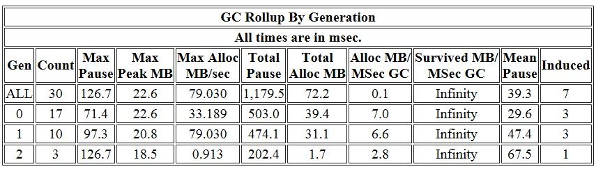
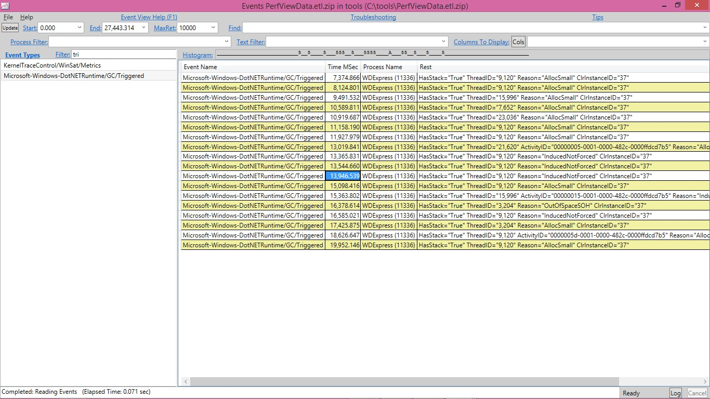
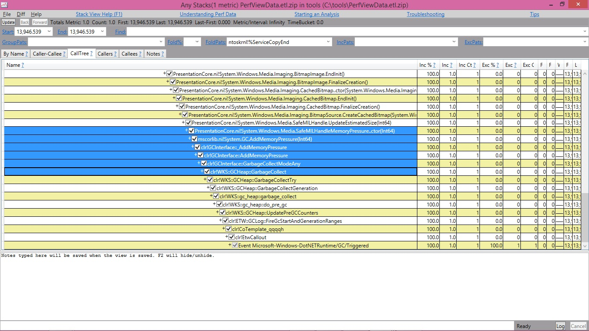

<h1>GC ETW events – 2</h1>

Before we continue from where we left off in the last blog entry I wanted to give a performance tip on managed memory analysis. 
As some of you who have already tried out Perfview you probably noticed it has a Heap Snapshot feature 
(in the PerfView UI, if you click on Memory\Take Heap Snapshot) which displays you the snapshot of the managed heap, ie, 
types in the heap and how many instances there are of each type and how they refer to each other.
Unless you have done some other analysis that gives you a good reason to start from here you normally don’t start from here 
(yes, even if you know heap size is the problem you still shouldn’t start from here unless you have other supporting evidence, such as you are getting OOM). Let me explain why.

Normally when someone wants to look at managed memory, he does so due to one or both of the following reasons:

1) pause time issue (eg, he probably noticed that his process is running slow and has looked at perf counters and noticed % time in GC is high; 
or his request is timing out because it’s not processed in a sufficient amount of time);

2) memory issue (eg, he probably noticed that his process’s private bytes perf counter shows a high value);

Now, before we dive into the reason why I said looking at the heap snapshot shouldn’t be the place to start normally, 
let’s refresh a few things about the .NET GC as they will be essential in understanding them.

.NET GC is a generational GC. The managed heap is divided into 3 generations – gen0, gen1 and gen2. 
Gen2 is the oldest generation meant for long lived data whereas gen0 and gen1 are what we call “ephemeral generations”. 
The youngest generation, gen0, is to accommodate newly allocated objects (I am leaving out large objects for now) 
and gen1 acts like the buffer between gen0 and gen2 to accommodate the inflight data when we do a GC.

This means we do 2 types of GCs – ephemeral GCs and full GCs, the former collects only ephemeral generations and the latter collects the whole heap,
 ie, gen0, 1 and 2. So the GC pause time is contributed by these GCs, not just the full GCs. So when you have a pause time issue, 
 it doesn’t mean you only need to look at full GCs – you need to look at what kind of GCs you did and what their pause times were. 
 It doesn’t even mean for the longest individual GC pauses you should always look at full GCs because full GCs can be done concurrently, 
 which means you could have gen2 GCs whose pauses are shorter than ephemeral GCs. And even if full GCs did have longest individual pauses, 
 it still doesn’t necessarily mean you should only look at them because you might be doing these GCs very infrequently, 
 and ephemeral GCs actually contribute to most of the GC pause time if the total GC pauses are your problem. So instead of assuming which GCs to look at, 
 since we provide PerfView for you to collect GC ETW events which accurately tell you what kind of GCs you did, their pause times, and other relevant info, why not use it, right? 🙂

When you look at the heap snapshot you will see all the objects on the heap (well, actually not all but all that’re representitive) 
and you might see one type of objects that take up the biggest percentage on the heap so you might then be trying to reduce that type of objects. 
But that might not be your problem because that may only reduce full blocking GC pauses but not necessarily other types of GCs. 
There are other possibilities – it could be that GCs are triggered too often (and most of which are gen0 GCs); 
it could be that gen2 objects do contribute to the ephemeral GC collection time but not the type that takes up the biggest percentage. 
Again, you should figure out what is causing problems before immediately trying to reduce the # of some objects.

Hopefully by now I have convinced you that you should be taking the look at GCStats, let’s look at it in more detail.

The first table is “GC Rollup By Generation”. The first thing jumping out at us about this table is the Induced column:

Most of time we’d expect to see all 0’s in this column but in this case this is not true! Not only is it not true, out of the 30 GCs a big percentage, 
23%, is induced GCs! This means we should at least take a look at these GCs see if they are also taking up a big chunk of the pause time. 
If that is the case, and pause time is a problem, that means we should figure out how these GCs were induced. In our case I am seeing

% Time paused for Garbage Collection: 7.1%

which means if we cared about this process’s performance GC seems like something interesting to look at. 
So let’s take a look at the “All GC Events” table and pay attention to the GCs whose “Trigger Reason” column says Induced*. 
InducedNotForced means someone asked to trigger a GC, 
and it’s up to GC to decide how it’s done – for gen0 and gen1 GCs it makes no difference to say it’s forced or not as they are always done as blocking. 
For gen2 it’s up to GC to decide to do them as background GCs or full blocking GCs.

In our case the induced GCs, even though their pause times don’t seem particularly long, but since the average pauses aren’t that long, 
these GCs do add up. So it does make sense to take a closer look. So let’s figure out who induced these GCs. 
Because this requires call stack info we’ll need to take another trace, repeating what we just ran while running perfview to collect more info. 
A simple way to get callstacks is to just run perfview with this commandline:

perfview collect

after we run this, I verified I am still seeing as many induced GC. I then open the trace in perfview, now I see there are a lot more options under the file name. 
This is because we have a lot more types of events and perfview can provide much more different types of analysis.

The easiest way to get to the bottom of induced GCs is to get the stacks for this event called GC/Triggered which is fired every time a GC is triggered. 
Let’s click on the Events view and in the Filter textbox we type in tri which says to show us any events with “tri” in their names and that’s enough to easily see the GC/Triggered events. 
If you don’t have this event, it means you are not running on a new enough version of the runtime. 
With the older version of the runtime you can still figure this out for workstation GC (which WDExpress process is using), 
however for server GC this is not really the right tool (which was the reason why we added the GC/Triggered event).

I’ll use the GC/Triggered event whose timestamp I highlighted as an example.

If I right click on it I see an option called Any stacks. Clicking on that shows me the stack for this event:

It turned out that WPF (presentation core) calls Add/RemoveMemoryPressure. The implementation of this API would trigger a non forced GC. 
Obviously calling A/RMP too often could trigger too many GCs. Another way to trigger a non forced GC is if someone called the GC.Collect API that takes the following args:

public static void Collect(int generation, GCCollectionMode mode, bool blocking);

and passed false for the last arg.

That’s all for today and we will continue next time.

Edited on 03/01/2020 to add the indices to GC ETW Event blog entries

https://devblogs.microsoft.com/dotnet/gc-etw-events-2/
