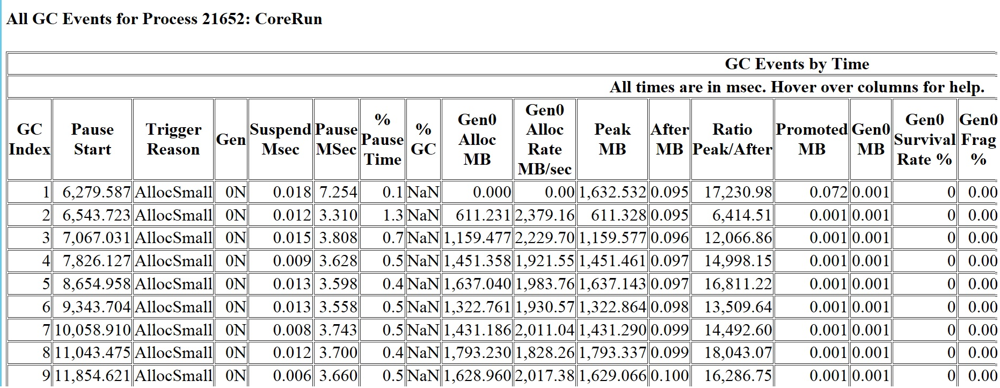

<h1>Running with Server GC in a Small Container Scenario Part 0</h1>

This week I was able to get some time to work on the container stuff with low memory limits. As many of you have expressed your dissatisfaction on how Server GC behaves with low memory limit specified on containers on github, I have to apologize that I am just doing this now. Really sorry that some of you guys have to suffer through this thus far. I wanted to share my investigation and some related knowledge – probably interesting as something folks could either apply to their own investigation or just a fun weekend read (that will perhaps reduce the frustration by a little bit :D).

First of all, as many of you already knew, Server GC was designed with the assumption that the process using Server GC is the dominant process on the machine. By default it uses as many heaps as there are # of processors on the machine. Technologies like asp.net use Server GC by default. And this is a great choice when your asp.net process is indeed the dominant process which had often been the case for many years. But as folks start to put these processes into containers with low/lower memory limits, it doesn’t bode well if for example your container only uses 200mb of memory and happening to be running on a machine with 48 procs – it doesn’t make sense to have 48 heaps to just collect 200mb. If you are specifying a very low memory limit a good way to go is to just switch to Workstation GC. I will be publishing guidelines on the # of heaps to pick and also making changes to Server GC to make the defaults better to accommodate these situations to make our customers’ lives easier. But in this blog entry I’d like to talk about what happens today to hopefully clear up some confusion.

If you do use Server GC on a machine with say 48 processors, like what Nick from the beloved stackoverflow.com did, you will observe that you are now using a lot more memory than if you use Workstation GC. He’s allocating only temporary objects and the heap is about 2.5GB with Server GC. As with any managed memory analysis, I would encourage any customer to start with an ETW trace which I talked about in this blog entry. So I’ll start with the most basic GCCollectOnly trace (note that if you want to get an idea how the memory is generally behaving you should always start with this, NOT a process dump. GC is not a point in time thing so looking at the GC heap at some random point in time is a meaningless way to get a general idea). I’m allocating only temporary objects on a 48 proc machine with 128GB memory and this is what GCStats shows me:

Right off the bat notice the PeakMB is way bigger than AfterMB. PeakMB is the heap size on entry of that GC and AfterMB is on exit. This is understandable as we are allocating only temporary objects. And also notice the PeakMB size is basically the same as Gen0AllocMB. So this confirms that the heap is made of basically only gen0 objects.

So now the question is, why did so much memory get allocated into gen0?

Well, so we have 48 heaps and each heap has its own gen0. And gen0 GCs get triggered when gen0’s allocation budget is consumed. I’ll pick 1.5GB as an approximate PeakMB size for this test. 1.5GB/48 = 31MB. So that means each gen0 had about 31MB allocated before the next GC happened. The actual gen0 budget is larger than this but any heap whose gen0 budget is exceeded will trigger a GC. 31MB is not outrageous on such a beefy machine but I do think it’s too big in this case. However I can’t carelessly change it because it might regress some existing scenarios. I will be spending some time to specifically look at the related code in the near future. But that explains the heap size. And this test is obviously very non real world like – most of the time old generations would take up way more space than gen0.

The next question is, why don’t we see the over memory usage go down after a GC? Memory in this case means commit size. If you think what happens in gen0 for each GC, gen0 looks like this on entry of GC#X

Copy
gen0_start | obj0 | obj1 | obj2 |…more objects
this is our ~31mb part, and obviously it’s 31mb committed space – the memory has to be committed for it to have data.

When this GC is done, almost everything gets collected (there are always some objects that survive, allocated by the runtimes itself or the library or from the stack) so gen0 looks like

Copy
gen0_start | empty_space
in order for the commit size to go down we’d need to decommit the 31mb empty_space. But why would we want to do that? You will be allocating in this space right away and 31mb later it’ll be repeating this cycle.

So GC keeps this portion after gen0_start committed. When there’s no pinning involved it’s almost always the gen0 budget the size of this portion is basically the gen0 budget (pinning is a much more complicated situation that’s beyond scope for this).

I will be talking about the actual container stuff in the next blog entry. I will leave you with the code I’ve been using to test stuff in a job object. On Windows you can specify resource limits on a job object and this is what I’ve been recommending to folks to use for containers. It’s a well establish technology for limiting not only memory but also CPU. Since I like to be as low level as possible I’m just calling the Win32 APIs myself. I’m using this with this commandline

Copy
RunInJob.exe memory_limit_in_MB corerun.exe "corerun.exe test.exe arg0 arg1 ..."
(I use corerun.exe to run tests on coreclr; and it’s intentional that corerun is specified twice)

Note that GC only reads the memory limits you specify on a job object when CLR is loaded. This is why the process is created as CREATE_SUSPENDED. And only when it’s been assigned to run in the job would we resume its main thread. If the process is already running and you put it in a job, it wouldn’t help ‘cause GC wouldn’t read it again.

Copy
int main(int argc, char** argv)
{
    if (argc > 1)
    {
        int pid = 0;
        int memoryLimitMB = atoi (argv[1]);
        HANDLE hProcess;
        HANDLE hMainThread;
        printf ("running %s in a job object and setting memory limits to %dmb\n", argv[2], memoryLimitMB);

        // start the process suspended.
        STARTUPINFOA si;
        PROCESS_INFORMATION pi;

        ZeroMemory (&si, sizeof (si));
        si.cb = sizeof (si);
        ZeroMemory (&pi, sizeof (pi));

        char* commandline = (argc > 3) ? argv[3] : NULL;
        printf ("CreateProcess %s %s\n", argv[2], commandline);
        if (!CreateProcessA (argv[2], commandline, NULL, NULL, FALSE, CREATE_SUSPENDED, NULL, NULL, &si, &pi))
        {
            printf ("CreateProcess %s %s failed (%d)\n", argv[1], commandline, GetLastError ());
            return 1;
        }

        pid = pi.dwProcessId;
        hProcess = pi.hProcess;
        hMainThread = pi.hThread;

        if (hProcess == NULL)
        {
            printf ("couldn't get handle to process %d, err: %d\n", pid, GetLastError ());
            return 1;
        }

        printf ("processs ID is %d\n", pid);

        // You can attach the debugger to the process if you wish to debug here.
        getchar ();

        HANDLE hJob = CreateJobObject (NULL, L"experimental job object");
        if (hJob == NULL)
        {
            printf ("couldn't create a job obj!! %d\n", GetLastError ());
            return 1;
        }

        size_t memoryLimit = (size_t)memoryLimitMB * 1024 * 1024;
        printf ("Setting memory limit to %dmb\n", memoryLimitMB);

        JOBOBJECT_EXTENDED_LIMIT_INFORMATION limitInfo;
        limitInfo.BasicLimitInformation.LimitFlags = JOB_OBJECT_LIMIT_JOB_MEMORY | JOB_OBJECT_LIMIT_PROCESS_MEMORY | JOB_OBJECT_LIMIT_WORKINGSET;
        limitInfo.JobMemoryLimit = memoryLimit;
        limitInfo.ProcessMemoryLimit = (memoryLimit / 1);
        // Note you must specify both max and min or you will get error 0x57 when calling SetInformationJobObject.
        //limitInfo.BasicLimitInformation.MaximumWorkingSetSize = (memoryLimit / 2);
        limitInfo.BasicLimitInformation.MaximumWorkingSetSize = (memoryLimit / 1);
        // apparently 10k is too low, it doesn't enforce it on the job.
        limitInfo.BasicLimitInformation.MinimumWorkingSetSize = 10 * 1024;  // 10k is a good lower bound.

        if (!SetInformationJobObject (hJob, JobObjectExtendedLimitInformation,
            &limitInfo, sizeof (JOBOBJECT_EXTENDED_LIMIT_INFORMATION)))
        {
            printf ("couldn't set limits on job obj!! %d\n", GetLastError ());
            return 1;
        }

        if (!AssignProcessToJobObject (hJob, hProcess))
        {
            printf ("failed to assign %d to job err: %d\n", pid, GetLastError ());
            return 1;
        }

        printf ("successfully set limits on job\n");

        ResumeThread (hMainThread);
        getchar ();
    }
    
    return 0;
}

https://devblogs.microsoft.com/dotnet/running-with-server-gc-in-a-small-container-scenario-part-0/