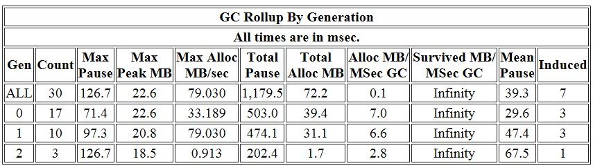
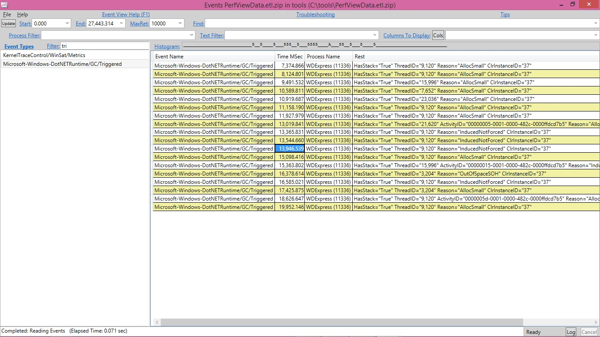
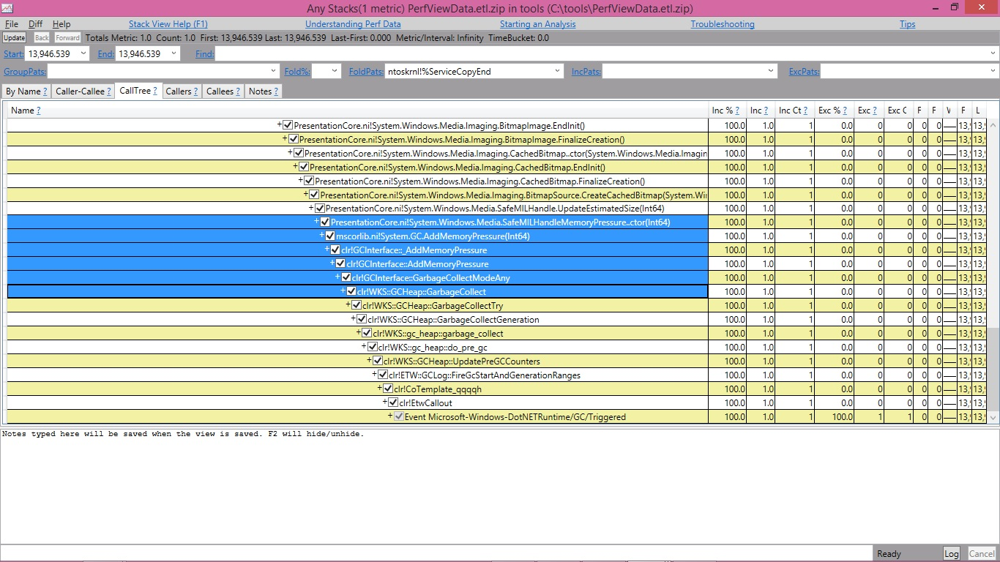

<h1>GC ETW events – 2</h1>

Before we continue from where we left off in the last blog entry I wanted to give a performance tip on managed memory analysis. 
As some of you who have already tried out Perfview you probably noticed it has a Heap Snapshot feature 
(in the PerfView UI, if you click on Memory\Take Heap Snapshot) which displays you the snapshot of the managed heap, ie, 
types in the heap and how many instances there are of each type and how they refer to each other.
Unless you have done some other analysis that gives you a good reason to start from here you normally don’t start from here 
(yes, even if you know heap size is the problem you still shouldn’t start from here unless you have other supporting evidence, such as you are getting OOM). Let me explain why.

Normally when someone wants to look at managed memory, he does so due to one or both of the following reasons:

1) pause time issue (eg, he probably noticed that his process is running slow and has looked at perf counters and noticed % time in GC is high; 
   or his request is timing out because it’s not processed in a sufficient amount of time);

2) memory issue (eg, he probably noticed that his process’s private bytes perf counter shows a high value);

Now, before we dive into the reason why I said looking at the heap snapshot shouldn’t be the place to start normally, 
let’s refresh a few things about the .NET GC as they will be essential in understanding them.

.NET GC is a generational GC. The managed heap is divided into 3 generations – gen0, gen1 and gen2. 
Gen2 is the oldest generation meant for long lived data whereas gen0 and gen1 are what we call “ephemeral generations”. 
The youngest generation, gen0, is to accommodate newly allocated objects (I am leaving out large objects for now) 
and gen1 acts like the buffer between gen0 and gen2 to accommodate the inflight data when we do a GC.

This means we do 2 types of GCs – ephemeral GCs and full GCs, the former collects only ephemeral generations and the latter collects the whole heap,
 ie, gen0, 1 and 2. So the GC pause time is contributed by these GCs, not just the full GCs. So when you have a pause time issue, 
 it doesn’t mean you only need to look at full GCs – you need to look at what kind of GCs you did and what their pause times were. 
 It doesn’t even mean for the longest individual GC pauses you should always look at full GCs because full GCs can be done concurrently, 
 which means you could have gen2 GCs whose pauses are shorter than ephemeral GCs. And even if full GCs did have longest individual pauses, 
 it still doesn’t necessarily mean you should only look at them because you might be doing these GCs very infrequently, 
 and ephemeral GCs actually contribute to most of the GC pause time if the total GC pauses are your problem. So instead of assuming which GCs to look at, 
 since we provide PerfView for you to collect GC ETW events which accurately tell you what kind of GCs you did, their pause times, and other relevant info, why not use it, right? 🙂

When you look at the heap snapshot you will see all the objects on the heap (well, actually not all but all that’re representitive) 
and you might see one type of objects that take up the biggest percentage on the heap so you might then be trying to reduce that type of objects. 
But that might not be your problem because that may only reduce full blocking GC pauses but not necessarily other types of GCs. 
There are other possibilities – it could be that GCs are triggered too often (and most of which are gen0 GCs); 
it could be that gen2 objects do contribute to the ephemeral GC collection time but not the type that takes up the biggest percentage. 
Again, you should figure out what is causing problems before immediately trying to reduce the # of some objects.

Hopefully by now I have convinced you that you should be taking the look at GCStats, let’s look at it in more detail.

The first table is “GC Rollup By Generation”. The first thing jumping out at us about this table is the Induced column:

Most of time we’d expect to see all 0’s in this column but in this case this is not true! Not only is it not true, out of the 30 GCs a big percentage, 
23%, is induced GCs! This means we should at least take a look at these GCs see if they are also taking up a big chunk of the pause time. 
If that is the case, and pause time is a problem, that means we should figure out how these GCs were induced. In our case I am seeing

% Time paused for Garbage Collection: 7.1%

which means if we cared about this process’s performance GC seems like something interesting to look at. 
So let’s take a look at the “All GC Events” table and pay attention to the GCs whose “Trigger Reason” column says Induced*. 
InducedNotForced means someone asked to trigger a GC, 
and it’s up to GC to decide how it’s done – for gen0 and gen1 GCs it makes no difference to say it’s forced or not as they are always done as blocking. 
For gen2 it’s up to GC to decide to do them as background GCs or full blocking GCs.

In our case the induced GCs, even though their pause times don’t seem particularly long, but since the average pauses aren’t that long, 
these GCs do add up. So it does make sense to take a closer look. So let’s figure out who induced these GCs. 
Because this requires call stack info we’ll need to take another trace, repeating what we just ran while running perfview to collect more info. 
A simple way to get callstacks is to just run perfview with this commandline:

perfview collect

after we run this, I verified I am still seeing as many induced GC. I then open the trace in perfview, now I see there are a lot more options under the file name. 
This is because we have a lot more types of events and perfview can provide much more different types of analysis.

The easiest way to get to the bottom of induced GCs is to get the stacks for this event called GC/Triggered which is fired every time a GC is triggered. 
Let’s click on the Events view and in the Filter textbox we type in tri which says to show us any events with “tri” in their names and that’s enough to easily see the GC/Triggered events. 
If you don’t have this event, it means you are not running on a new enough version of the runtime. 
With the older version of the runtime you can still figure this out for workstation GC (which WDExpress process is using), 
however for server GC this is not really the right tool (which was the reason why we added the GC/Triggered event).

I’ll use the GC/Triggered event whose timestamp I highlighted as an example.

If I right click on it I see an option called Any stacks. Clicking on that shows me the stack for this event:

It turned out that WPF (presentation core) calls Add/RemoveMemoryPressure. The implementation of this API would trigger a non forced GC. 
Obviously calling A/RMP too often could trigger too many GCs. Another way to trigger a non forced GC is if someone called the GC.Collect API that takes the following args:

public static void Collect(int generation, GCCollectionMode mode, bool blocking);

and passed false for the last arg.

That’s all for today and we will continue next time.

Edited on 03/01/2020 to add the indices to GC ETW Event blog entries

https://devblogs.microsoft.com/dotnet/gc-etw-events-2/

在继续上一篇博客的内容之前，我想分享一个关于托管内存分析的性能优化建议。有些已经尝试过PerfView的朋友可能已经注意到，它有一个堆快照功能（在PerfView UI中，点击Memory\Take Heap Snapshot），可以显示托管堆的快照，即堆中的类型、每种类型的实例数量以及它们之间的引用关系。除非你已经通过其他分析找到了合理的起点，否则通常不应该从这里开始（是的，即使你知道堆大小是问题所在，除非你有其他支持性证据，比如出现了内存不足（OOM）的情况，否则也不应该从这里开始）。让我解释一下原因。

通常，当有人想要查看托管内存时，他这样做是因为以下一个或两个原因：

1. **暂停时间问题**（例如，他可能注意到进程运行缓慢，查看了性能计数器，发现GC时间百分比很高；或者他的请求超时，因为没有在足够的时间内处理）；

2. **内存问题**（例如，他可能注意到进程的私有字节性能计数器显示了一个很高的值）；

在深入探讨为什么我说堆快照通常不应该是起点之前，让我们先回顾一下关于.NET垃圾回收（GC）的一些基本知识，因为这些知识对于理解后续内容至关重要。

.NET GC是一个分代GC。托管堆分为3个代——gen0、gen1和gen2。Gen2是最老的代，用于存放长期存活的数据，而gen0和gen1被称为“短暂代”。最年轻的代gen0用于容纳新分配的对象（暂时不考虑大对象），而gen1则充当gen0和gen2之间的缓冲区，用于在GC时容纳正在处理的数据。

这意味着我们有两种类型的GC——短暂代GC和完全GC，前者只收集短暂代，而后者收集整个堆，即gen0、gen1和gen2。因此，GC暂停时间是由这些GC贡献的，而不仅仅是完全GC。所以当你遇到暂停时间问题时，并不意味着你只需要查看完全GC——你需要查看你进行了哪些类型的GC以及它们的暂停时间是多少。这甚至不意味着对于最长的单个GC暂停，你应该总是查看完全GC，因为完全GC可以是并发的，这意味着你可能会有gen2 GC，其暂停时间比短暂代GC更短。即使完全GC确实有最长的单个暂停时间，这仍然不意味着你应该只关注它们，因为你可能很少进行这些GC，而短暂代GC实际上可能贡献了大部分的GC暂停时间，如果总GC暂停时间是你的问题的话。因此，与其假设要查看哪些GC，不如使用PerfView来收集GC ETW事件，这些事件会准确地告诉你你进行了哪些类型的GC、它们的暂停时间以及其他相关信息，对吧？😊

当你查看堆快照时，你会看到堆上的所有对象（实际上并不是所有对象，但所有有代表性的对象），你可能会看到一种类型的对象占据了堆上最大的百分比，因此你可能会试图减少这种类型的对象。但这可能并不是你的问题，因为这可能只会减少完全阻塞的GC暂停，而不一定会减少其他类型的GC。还有其他可能性——可能是GC触发得太频繁（其中大部分是gen0 GC）；也可能是gen2对象确实贡献了短暂代GC的收集时间，但不是占据最大百分比的那种类型。再次强调，你应该先找出问题的根源，而不是立即尝试减少某些对象的数量。

希望到现在为止，我已经说服你应该先查看GCStats，让我们更详细地看看它。

第一个表格是“按代汇总的GC统计”。这张表中首先引起我们注意的是“Induced”列：



大多数时候，我们期望看到这一列全是0，但在这个例子中并非如此！不仅不是0，而且在30次GC中，有23%是诱导GC！这意味着我们至少应该看看这些GC是否也占据了大部分的暂停时间。如果是这样，并且暂停时间是一个问题，那么我们应该弄清楚这些GC是如何被诱导的。在我们的例子中，我看到：

垃圾回收暂停时间百分比：7.1%

这意味着如果我们关心这个进程的性能，GC似乎是一个值得关注的点。所以让我们看看“所有GC事件”表，并关注那些“Trigger Reason”列显示为“Induced*”的GC。InducedNotForced意味着有人要求触发GC，而GC会决定如何执行——对于gen0和gen1 GC来说，是否强制没有区别，因为它们总是以阻塞方式执行。对于gen2 GC，GC会决定是以后台GC还是完全阻塞GC的方式执行。

在我们的例子中，尽管诱导GC的暂停时间看起来并不特别长，但由于平均暂停时间并不长，这些GC确实会累积起来。因此，确实有必要更仔细地看看。所以让我们弄清楚是谁诱导了这些GC。因为这需要调用栈信息，我们需要再运行一次跟踪，重复我们刚刚运行的内容，同时运行PerfView以收集更多信息。获取调用栈的一个简单方法是使用以下命令行运行PerfView：

复制

perfview collect

运行后，我确认我仍然看到了同样多的诱导GC。然后我在PerfView中打开了这个跟踪文件，现在我看到文件名下有更多的选项。这是因为我们有更多类型的事件，PerfView可以提供更多不同类型的分析。

找出诱导GC的最简单方法是获取名为GC/Triggered的事件的调用栈，该事件在每次GC触发时都会触发。让我们点击“Events”视图，在过滤器文本框中输入“tri”，这会显示名称中包含“tri”的事件，这样我们就能轻松看到GC/Triggered事件。如果你没有这个事件，这意味着你运行的运行时版本不够新。在较旧的运行时版本中，你仍然可以为工作站GC（WDExpress进程使用的）找出这一点，但对于服务器GC来说，这并不是合适的工具（这也是我们添加GC/Triggered事件的原因）。

我将使用我高亮显示的GC/Triggered事件的时间戳作为示例。



如果我右键点击它，我会看到一个名为“Any stacks”的选项。点击它会显示该事件的调用栈：



结果发现，WPF（Presentation Core）调用了Add/RemoveMemoryPressure。这个API的实现会触发一个非强制的GC。显然，频繁调用A/RMP可能会触发过多的GC。另一种触发非强制GC的方法是，如果有人调用了以下参数的GC.Collect API：

csharp

复制

public static void Collect(int generation, GCCollectionMode mode, bool blocking);

并将最后一个参数设置为false。

今天就到这里，我们下次继续。

2020年3月1日编辑，添加了GC ETW事件博客条目的索引。
