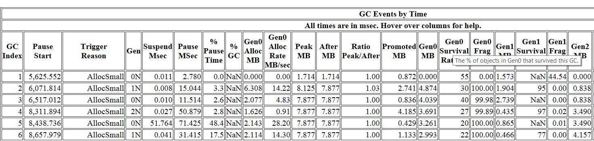

<h1>GC ETW Events – 3</h1>

In the last blog entry we looked at a particular GC trigger reason – InducedNotForced GCs. There are 2 other triggered reasons for induced GCs are:

InducedLowMemory – GC subscribes to the low memory notification from the OS and when the OS notifies us that “the memory is low on the machine” a GC is induced; 
or if this is a hosted process and the host indicates we are low on memory, we also induce a GC.

Induced – this is your “common” case of induced GCs, usually it comes from the user code that calls GC.Collect 
(as I mentioned in the last blog entry if the user calls GC.Collect and passes false as blocking, it would show up as InducedNotForced).

The other types of trigger reasons are because of allocations. In Using GC Efficiently – Part 1 I talked about the 3 situations a GC is triggered. 
The most common situation is managed allocations. Out of those reasons the most common you’d see (and want to see) is AllocSmall – this is saying the gen0 threshold is exceeded. 
If the most common one you see is say AllocLarge it most likely indicates a problem – it’s saying your GC was triggered because you exceeded the threshold for LOH allocating large objects. 
And as we know that triggers a full GC and keeping triggering full GCs is usually a recipe for performance problems. 
Other trigger reasons due to allocations are OutOfSpaceSOH and OutOfSpaceLOH – you see these much less frequently than AllocSmall and AllocLarge – these are for 
when you are close to physical space limit (eg, if we are getting close to the end of the ephemeral segment).

If you looked far enough you’ll notice a table called “Condemned reasons for GCs”. So what is the difference between “trigger reason” and “condemned reason”?

When I first started working on the .NET GC there was lots of confusion as to when/how a GC is triggered. I remember one of the misunderstandings was to explain how a gen2 GC was triggered. 
The explanation was “GC will do a gen0 GC first; if that’s not enough, it will do a gen1 GC; 
if that’s still not enough, it will do a gen2 GC”. Well, that would be quite inefficient but it does serve as good context info for explaining the difference between those 2 reasons. 
“Trigger reason” is how a GC starts or comes into existence. If the most common reason for a GC to start is due to allocating on the SOH, 
that GC would start as a gen0 GC (because the gen0 threshold was exceeded). Now after the GC starts, we then decide what generation we would actually collect. 
It might stay as a gen0 GC, or get escalated to a gen1 or even a gen2 GC – this is something we decide as one of the very first things we do in a GC. 
And factors that would cause us to escalate to a high generation GC are what we called “condemned reasons” (so for a GC there’s only one trigger reason but can be multiple condemned reasons).

For the “Condemned reasons for GC” table it says

This table gives a more detailed account of exactly why a GC decided to collect that generation. Hover over the column headings for more info.

I won’t repeat the info here but you can see the difference between the 2nd column (Initial Requested Generation) and the 3rd column (Final Generation). 
The former is the generation when the GC is triggered while the latter is after we went through the condemned reasons the generation we landed at. So the former is always <= the latter.

Now let’s take a look at other columns in the GC tables.

These also have explanations of the columns so if you hover over the column header you will see what that column is for. 
The next 2 columns interesting to talk about are “Suspend MSec” and “Pause MSec”. 
The “Pause MSec” column is what tells you how long your threads were paused for due to GC. And “Suspend MSec” is part of this pause (this is usually a small number; 
if not then that would indicate a problem). Let me explain how these columns are calculated – it’s useful to know because you could incoporate this into your perf automation framework as some of our internal teams do. One very useful thing you could measure with this is for your request latency you can tell exactly how much the GC pause contributed to it (and you can tell for example how often and how much GC pause is the problem for your longest requests).

(suspension and resumption are explained here)

The GC ETW events are documented here. And the relevant ones for pause time are (you can get the event ID and field description on the MSDN page):

GCStart_V1 Event

GCEnd_V1 Event

GCSuspendEE_V1 Event

GCSuspendEEEnd_V1 Event

GCRestartEEBegin_V1 Event

GCRestartEEEnd_V1 Event

In a typical blocking GC (this means all ephemeral GCs and full blocking GCs) the event sequence is very simple:

GCSuspendEE_V1 Event

GCSuspendEEEnd_V1 Event <– suspension is done

GCStart_V1 Event

GCEnd_V1 Event <– actual GC is done

GCRestartEEBegin_V1 Event

GCRestartEEEnd_V1 Event <– resumption is done.

GCSuspendEE_V1 and GCSuspendEEEnd_V1 are for suspension; and GCRestartEEBegin_V1 and GCRestartEEEnd_V1 are for resumption.

The Suspension MSec column is simply (timestamp of the GCSuspendEEEnd_V1 – timestamp of the GCSuspendEE_V1). 
We don’t give you the time it takes to resume as it’s very, very short. And the Pause MSec” column is (timestamp of the GCRestartEEEnd_V1 – timestamp of the GCSuspendEE_V1) 
so this requires the longest possible pause introduced by this GC – “longest possible” is because there are threads that are running for part of the suspension and resumption.

However for a background GC it’s quite a bit more complicated. It is explained here:. It shows a background GC with one foreground GC happening during its duration. 
We know that all foreground GCs are ephemeral GCs which means they all follow the simple sequence we have above. 
If we add in the suspension/resumption from the background GC itself it’ll look like this:

1) GCSuspendEE_V1 Event

2) GCSuspendEEEnd_V1 Event

3) GCStart_V1 Event <– BGC starts

There might be a gen0 or gen1 GC happening here and if so you’d see this sequence

GCStart_V1 Event <– gen0 or gen1 starts

GCEnd_V1 Event <– gen0 or gen1 GC is done

4) GCRestartEEBegin_V1 Event

5) GCRestartEEEnd_V1 Event <– done with the initial suspension

There might be 0 or more foreground gen0 or gen1 GC happening here and if so you’d see this sequence

GCSuspendEE_V1 Event

GCSuspendEEEnd_V1 Event <– suspension for foreground GC is done

GCStart_V1 Event

GCEnd_V1 Event <– foreground GC is done

GCRestartEEBegin_V1 Event

GCRestartEEEnd_V1 Event <– resumption for foreground GC is done

6) GCSuspendEE_V1 Event

7) GCSuspendEEEnd_V1 Event

8) GCRestartEEBegin_V1 Event

9) GCRestartEEEnd_V1 Event <– done with BGC’s own suspension

Again, there might be 0 or more foreground gen0 or gen1 GC happening here

10) GCEnd_V1 Event <– BGC ends

That concludes our pause data explanation.

Edited on 03/01/2020 to add the indices to GC ETW Event blog entries

https://devblogs.microsoft.com/dotnet/gc-etw-events-3/

在上一篇博客中，我们探讨了一种特定的GC触发原因——InducedNotForced GCs。除此之外，还有两种触发诱导GC的原因：

1.InducedLowMemory —— GC会订阅操作系统的低内存通知，当操作系统通知我们“机器内存不足”时，会触发一次GC；或者如果这是一个托管进程，并且宿主指示我们内存不足，我们也会触发一次GC。

2.Induced —— 这是“常见”的诱导GC情况，通常来自用户代码调用GC.Collect（正如我在上一篇博客中提到的，如果用户调用GC.Collect并传递false作为阻塞参数，它将显示为InducedNotForced）。

其他类型的触发原因与分配有关。在《高效使用GC——第1部分》中，我讨论了触发GC的三种情况。最常见的情况是托管分配。在这些原因中，最常见（也是你希望看到的）是AllocSmall —— 这意味着gen0的阈值被超过了。如果你最常见的是AllocLarge，那很可能表明存在问题 —— 这意味着你的GC被触发是因为你超过了LOH（大对象堆）分配大对象的阈值。正如我们所知，这会触发一次完整的GC，而频繁触发完整GC通常会导致性能问题。其他与分配相关的触发原因是OutOfSpaceSOH和OutOfSpaceLOH —— 这些情况比AllocSmall和AllocLarge少见得多 —— 这些是当你接近物理空间限制时发生的（例如，如果我们接近临时段的末尾）。

如果你看得足够仔细，你会注意到一个名为“GC的谴责原因”的表格。那么“触发原因”和“谴责原因”之间有什么区别呢？

当我刚开始研究.NET GC时，关于GC何时/如何触发有很多混淆。我记得其中一个误解是解释如何触发gen2 GC。解释是“GC会先进行gen0 GC；如果这还不够，它会进行gen1 GC；如果仍然不够，它会进行gen2 GC”。嗯，这确实效率不高，但它确实为解释这两个原因之间的区别提供了很好的背景信息。“触发原因”是GC如何启动或产生的原因。如果GC启动的最常见原因是由于在SOH（小对象堆）上分配，那么GC将作为gen0 GC启动（因为gen0的阈值被超过了）。现在，在GC启动后，我们决定实际要回收哪个代。它可能保持为gen0 GC，或者升级为gen1甚至gen2 GC —— 这是我们在GC开始时决定的事情之一。导致我们升级到更高代GC的因素就是我们所说的“谴责原因”（因此，对于一次GC，只有一个触发原因，但可能有多个谴责原因）。

对于“GC的谴责原因”表格，它说：

这个表格提供了更详细的解释，说明GC为什么决定回收那个代。将鼠标悬停在列标题上以获取更多信息。

我不会在这里重复这些信息，但你可以看到第二列（初始请求代）和第三列（最终代）之间的区别。前者是GC触发时的代，而后者是我们经过谴责原因后最终确定的代。因此，前者总是小于或等于后者。

现在让我们看看GC表格中的其他列。

alt text

这些列也有解释，所以如果你将鼠标悬停在列标题上，你会看到该列的含义。接下来两个有趣的列是“Suspend MSec”和“Pause MSec”。“Pause MSec”列告诉你由于GC导致线程暂停了多长时间。“Suspend MSec”是暂停的一部分（这通常是一个很小的数字；如果不是，那可能表明存在问题）。让我解释一下这些列是如何计算的 —— 了解这一点很有用，因为你可以将其纳入你的性能自动化框架中，就像我们的一些内部团队所做的那样。你可以用这个来测量请求延迟中GC暂停的贡献（例如，你可以知道GC暂停对你的最长请求的频率和影响有多大）。

（暂停和恢复的解释在这里）

GC ETW事件的文档在这里。与暂停时间相关的有（你可以在MSDN页面上找到事件ID和字段描述）：

1.GCStart_V1 事件

2.GCEnd_V1 事件

3.GCSuspendEE_V1 事件

4.GCSuspendEEEnd_V1 事件

5.GCRestartEEBegin_V1 事件

6.GCRestartEEEnd_V1 事件

在一个典型的阻塞GC中（这意味着所有临时GC和完整的阻塞GC），事件序列非常简单：

1.GCSuspendEE_V1 事件

2.GCSuspendEEEnd_V1 事件 <– 暂停完成

3.GCStart_V1 事件

4.GCEnd_V1 事件 <– 实际GC完成

5.GCRestartEEBegin_V1 事件

6.GCRestartEEEnd_V1 事件 <– 恢复完成

GCSuspendEE_V1 和 GCSuspendEEEnd_V1 用于暂停；GCRestartEEBegin_V1 和 GCRestartEEEnd_V1 用于恢复。

“Suspend MSec”列只是（GCSuspendEEEnd_V1 的时间戳 - GCSuspendEE_V1 的时间戳）。我们不提供恢复所需的时间，因为它非常非常短。“Pause MSec”列是（GCRestartEEEnd_V1 的时间戳 - GCSuspendEE_V1 的时间戳），因此这需要此GC引入的最长可能暂停 —— “最长可能”是因为有些线程在暂停和恢复期间部分时间仍在运行。

然而，对于后台GC来说，情况要复杂得多。这里解释了这一点。它展示了一个后台GC，在其持续时间内发生了一次前台GC。我们知道所有前台GC都是临时GC，
这意味着它们都遵循我们上面的简单序列。如果我们加入后台GC本身的暂停/恢复，它将看起来像这样：

1.GCSuspendEE_V1 事件

2.GCSuspendEEEnd_V1 事件

3.GCStart_V1 事件 <– BGC开始

这里可能会发生gen0或gen1 GC，如果是这样，你会看到这个序列：

1.GCStart_V1 事件 <– gen0或gen1开始

2.GCEnd_V1 事件 <– gen0或gen1 GC完成

3.GCRestartEEBegin_V1 事件

4.GCRestartEEEnd_V1 事件 <– 初始暂停完成

这里可能会发生0次或多次前台gen0或gen1 GC，如果是这样，你会看到这个序列：

1.GCSuspendEE_V1 事件

2.GCSuspendEEEnd_V1 事件 <– 前台GC的暂停完成

3.GCStart_V1 事件

4.GCEnd_V1 事件 <– 前台GC完成

5.GCRestartEEBegin_V1 事件

6.GCRestartEEEnd_V1 事件 <– 前台GC的恢复完成

7.GCSuspendEE_V1 事件

8.GCSuspendEEEnd_V1 事件

9.GCRestartEEBegin_V1 事件

10.GCRestartEEEnd_V1 事件 <– BGC自身的暂停完成

同样，这里可能会发生0次或多次前台gen0或gen1 GC

GCEnd_V1 事件 <– BGC结束

这就是我们对暂停数据的解释。

2020年3月1日编辑，添加了GC ETW事件博客条目的索引。