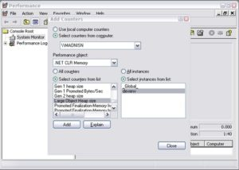

<h1>Large Object Heap Uncovered (an old MSDN article)</h1>

I wrote this article in 2008 and the MSDN website no longer has it so I am making it available here. 
Please note that it has been quite a while and some things related to LOH have changed quite a bit. See the GC ETW blog entries I wrote for the current tooling options. 
Also note that obviously some of the links mentioned in this article may no longer exist.

The .NET Garbage Collector divides objects up into small and large objects. When an object is large some attributes associated with it become more significant than if the object is small. 
For instance, compacting it, meaning copying the memory elsewhere on the heap, is expensive. In this article we are going to look at the large object heap in depth. 
We will talk about what qualifies an object as a large object, how these large objects are collected and what kind of performance implications large objects impose.

How an object ends up on the large object heap and how GC handles them.

In .NET 1.1 and 2.0 if an object is >= 85,000 bytes it’s considered a large object. This number was determined by performance tuning. 
When an object allocation request comes in, if it’s >= 85,000 bytes, we will allocate it on the large object heap. What does this mean exactly? To understand this, 
it may be beneficial to explain some fundamentals about the .NET GC.

As many of you are aware, the .NET Garbage Collect is a generational collector. It has 3 generations – generation 0, generation 1 and generation 2. 
The reason behind having 3 generations is that we expect for a well tuned app, most objects die in Gen0. For example, in a server app,
 the allocations associated each request should die after the request is finished. And the in flight allocation requests will make into Gen1 and die there. 
 Essentially Gen1 acts as a buffer between young object areas and long lived object areas.

From the generation point of view, large objects belong to generation 2 because they are collected only when we do a generation 2 collection.

When a generation gets collected, all its younger generation(s) also get collected. So for example, when a generation 1 GC happens, 
both generation 1 and 0 get collected. And when a generation 2 GC happens, the whole heap gets collected. For this reason a generation 2 GC is also called a full GC. 
In this article I will use generation 2 GC instead of full GC but they are interchangeable.

So generations are the logical view of the GC heap. Physically, objects live on the managed heap segments. 
A managed heap segment is a chunk of memory that the GC reserves from the OS (via calling VirtualAlloc) on behalf of managed code. 
When the CLR gets loaded we allocate 2 initial heap segments – one for small objects and one for large objects which we will refer to as SOH (Small Object Heap) 
and LOH (Large Object Heap) respectively.

The allocation requests are then satisfied by putting managed objects on this managed heap segment. If the object is less than 85,000 byte it will be put on the segment for SOH; 
otherwise it’ll be on a LOH segment. Segments are committed (in smaller chunks) as more and more objects are allocated onto them.

For SOH, objects that survive a GC get promoted to the next generation; so objects that survive a generation 0 collection will now be considered generation 1 objects, and so on. 
Objects that survive the oldest generation, however, will still be considered in the oldest generation. In other words, survivors from generation 2 will be generation 2 objects; 
and survivors from LOH will be LOH objects (collected with gen2). The user code can only allocate in generation 0 (small objects) or LOH (large objects). 
Only GC can “allocate” objects in generation 1 (by promoting survivors from generation 0) and generation 2 (by promoting survivors from generation 1 and 2).

When a GC is triggered, we trace through the live objects and compact them. For LOH though, because compaction is expensive we choose to sweep them, 
meaning making a free list out of dead objects that can be reused later to satisfy large object allocation requests. Adjacent dead objects are made into one free object.

An important thing to keep in mind is that even though today we don’t compact LOH, we might in the future. 
So if you allocate large objects and want to make sure that they don’t move you should still pin them.

Note that the figures below are only for illustration purposes – I use very few objects to show what happens on the heap. In reality there are much more objects there.

Fig. 1 illustrates a scenario where we form generation 1 after the first generation 0 GC where Obj1 and Obj3 are dead; 
and we form generation 2 after the first generation 1 GC where Obj2 and Obj5 are dead.

Fig. 2 illustrates that after a generation 2 GC which saw that Obj1 and Obj2 being dead we formed one free space out of memory that used to be occupied by Obj1 and Obj2 
which then was used to satisfy allocation request for Obj4. The space after the last object Obj3 till end of the segment can also be used to satisfy allocation requests.

If we don’t have enough free space to accommodate the large object allocation requests we will first attempt to acquire more segments from the OS. 
If that fails then we will trigger a generation 2 GC in hope of freeing up some space.

During a generation 2 GC we take the opportunity to release segments that have no live objects on them back to the OS (by calling VirtualFree). 
Space after the last live object till the end of the segment is decommitted. And the free spaces remain committed though they are reset, 
meaning the OS doesn’t need to write data in them back to disk. Fig. 3 illustrate a scenario where we released one segment back to the OS (segment 2) and decommitted 
more space on the remaining segments. If we need to use the decommitted space at the end of the segment to satisfy large object allocation requests we will commit the memory again.

For an explanation on commit/decommit please see the msdn documentation on VirtualAlloc.

When a large object gets collected

To answer this question, let’s first talk about when a GC happens in general. A GC occurs if one of the following 3 conditions happens:

1)     Allocation exceeds the generation 0 or large object threshold;

2)     System.GC.Collect is called;

3)     System is in low memory situation;

The threshold is a property of a generation. When you allocate objects into a generation you set the threshold we set for that generation. 
And when the threshold is exceeded for a generation a GC is triggered on that generation. So when you allocate small or large objects you consume generation 0 and LOH’s respective threshold. 
And when GC allocates into generation 1 and 2 it consumes their thresholds. These thresholds are dynamically tuned as the program runs.

1) is your typical case – most GCs happen because of allocations on the managed heap. 2) is the case when someone calls GC.Collect. 
If it’s called on generation 2 (by passing either no arguments to GC.Collect or passing GC.MaxGeneration as an argument) LOH will get collected right away 
along with the rest of the managed heap. 3) happens when we receive the high memory notification from the OS and if we think doing a generation 2 GC will be productive we will trigger one.

LOH Performance Implications

1) Allocation cost.

The CLR makes the guarantee that the memory for every new object we give out is cleared. 
This means the allocation cost of a large object is completely dominated by memory clearing (unless it triggers a GC). If it takes 2 cycles to clear one byte, 
it means it takes 170,000 cycles to clear the smallest large object. It’s not uncommon that people allocate large objects that are a few to many MBs. 
For a 16MB object on a 2GHz machine it’ll take approximately 16ms to clear the memory. That’s a rather large cost.

2) Collection cost.

As we mentioned above, LOH and generation 2 are collected together. If either one’s threshold is exceeded it will trigger a generation 2 collection. 
If a generation 2 was triggered because of LOH, generation 2 itself won’t necessarily get much smaller after the GC. Now, 
if there’s not much data on generation 2 this is not a problem. But if generation 2 is big it could cause performance problems if many generation 2 GCs are triggered. 
If many large objects are allocated on a very temporary basis and you have a big SOH, you could be spending too much time doing GCs; 
not to mention the allocation cost can really add up if you keep allocating and letting go really large objects.

3) Very large objects on LOH are usually arrays (it’s very rare to have an instance object that’s really really large). 
If the elements of an array are reference rich it incurs cost that is not present if the elements are not reference rich. 
If the element doesn’t contain any references we wouldn’t need to go through the array at all. For example, 
if you use an array to store nodes in a binary tree, one way to implement it is to refer to a node’s right and left node by the actual nodes:

class Node {     Data d;     Node left;     Node right; };

Node[] binary_tr = new Node [num_nodes];

If num_nodes is a large number it means we will need to go through at least 2 references per element. An alternative approach is to store the index of the right and the left node:

class Node {     Data d;     uint left_index;     uint right_index; };

This way instead of referring the left node’s data as left.d you refer to it as binary_tr[left_index].d. And GC wouldn’t need to look at any references for left and right node.

Out of the 3 factors, the first 2 are usually more dominating factors than the 3rd one.

Based on this it’s recommended that it would be best if you could allocate a pool of large objects and reuse them instead of allocating temporary ones. 
Yun Jin has a good example of such a buffer pool in his blog entry. Of course you would want to make the buffer size larger.

Collecting performance data for the LOH

There are a few ways to collect performance data that’s relevant for the LOH. But before I explain them, let’s talk about why you would want to collect performance data for LOH.

Before you start collecting performance data for a specific area hopefully you have already done the following:

1) found evidence that you should be looking at this area or

2) exhausted other areas that you know of and didn’t find any problems that could explain the performance problem you saw.

I would recommend reading this blog entry for more explanation. It talks about the fundamentals about memory and CPU.

The Investigating Memory Issues MSDN article talks about steps of diagnosing performance problems in a managed process that may be related to managed heap.

1) .NET CLR Memory Performance counters

These performance counters are usually a good first step in investigating performance issues. The ones that are relevant for LOH are:

# Gen 2 Collections:

Displays the number of times the generation 2 GCs have occurred since the process started. The counter is incremented at the end of a generation 2 garbage collection 
(also called a full garbage collection). This counter displays the last observed value.

Large Object Heap size

Displays the current size, in bytes, including the free space, of the Large Object Heap. This counter is updated at the end of a garbage collection, not at each allocation.

A common way to look at performance counters is via Performance Monitor (perfmon.exe). Use “Add Counters” to add the interesting counter for processes that you care about.

You can save the performance counter data to a log file in perfmon.

Performance counters can also be queried programmatically. Many people collect them this way as part of their routine testing process. 
When they spot counters with values that are out of ordinary they will use other means to get more detailed to help with the investigation.

2) Using a debugger

The debugging commands mentioned in this section are applicable to the Windows Debuggers.

If you need to look at what objects are actually on the LOH you can use the SoS debugger extension provided by the CLR (explained in the Investigating Memory Issues article). 
An example output of analyzing the LOH is below:

0:003> .loadby sos mscorwks 0:003> !eeheap -gc Number of GC Heaps: 1 generation 0 starts at 0x013e35ec generation 1 starts at 0x013e1b6c generation 2 starts at 0x013e1000 ephemeral segment allocation context: none segment   begin allocated     size 0018f2d0 790d5588 790f4b38 0x0001f5b0(128432) 013e0000 013e1000 013e35f8 0x000025f8(9720) Large object heap starts at 0x023e1000 segment   begin allocated     size 023e0000 023e1000 033db630 0x00ffa630(16754224) 033e0000 033e1000 043cdf98 0x00fecf98(16699288) 043e0000 043e1000 05368b58 0x00f87b58(16284504) Total Size 0x2f90cc8(49876168) —————————— GC Heap Size 0x2f90cc8(49876168) 0:003> !dumpheap -stat 023e1000 033db630 total 133 objects Statistics: MT   Count   TotalSize Class Name 001521d0       66     2081792     Free 7912273c       63     6663696 System.Byte[] 7912254c       4     8008736 System.Object[] Total 133 objects

This says that the LOH heap size is (16,754,224 + 16,699,288 + 16,284,504 =) 49,738,016 bytes. And between address 023e1000 and 033db630, 8,008,736 bytes are occupied by System.Object[] objects; 6,663,696 are occupied by System.Byte[] objects and 2,081,792 bytes are occupied by free space.

Sometimes you’ll see the total size of the LOH being less than 85,000 bytes, why is this? 
Because the runtime itself actually uses LOH to allocate some objects that are smaller than a large object.

Since LOH are not compacted, sometimes people suspect that LOH is the source of fragmentation. 
When we talk about “fragmentation” we need to first clarify what fragmentation means. 
There’s fragmentation of the managed heap which is indicated by the amount of free space between managed objects (ie, what you see when you do !dumpheap –type Free in SoS); 
there’s also fragmentation of the virtual memory address space which is the memory marked as MEM_FREE type which you can get by various debugger commands in windbg. 
Below is an example that shows the fragmentation in the VM space:

0:000> !address 00000000 : 00000000 – 00010000 Type     
00000000 Protect 00000001 PAGE_NOACCESS State   
00010000 MEM_FREE Usage   RegionUsageFree 
00010000 : 00010000 – 00002000 Type     
00020000 MEM_PRIVATE Protect 00000004 PAGE_READWRITE State   
00001000 MEM_COMMIT Usage   RegionUsageEnvironmentBlock 00012000 : 00012000 – 0000e000 Type     
00000000 Protect 00000001 PAGE_NOACCESS State   00010000 MEM_FREE Usage   RegionUsageFree

… [omitted]

——————– Usage SUMMARY ————————– TotSize (     KB)   Pct(Tots) Pct(Busy)   Usage 701000 (   7172) : 00.34%   20.69%   : RegionUsageIsVAD 7de15000 ( 2062420) : 98.35%   00.00%   : RegionUsageFree 1452000 (   20808) : 00.99%   60.02%   : RegionUsageImage 300000 (   3072) : 00.15%   08.86%   : RegionUsageStack 3000 (     12) : 00.00%   00.03%   : RegionUsageTeb 381000 (   3588) : 00.17%   10.35%   : RegionUsageHeap 0 (       0) : 00.00%   00.00%   : RegionUsagePageHeap 1000 (       4) : 00.00%   00.01%   : RegionUsagePeb 1000 (       4) : 00.00%   00.01%   : RegionUsageProcessParametrs 2000 (       8) : 00.00%   00.02%   : RegionUsageEnvironmentBlock Tot: 7fff0000 (2097088 KB) Busy: 021db000 (34668 KB)   ——————– Type SUMMARY ————————– TotSize (     KB)   Pct(Tots) Usage 7de15000 ( 2062420) : 98.35%   : <free> 1452000 (   20808) : 00.99%   : MEM_IMAGE 69f000 (   6780) : 00.32%   : MEM_MAPPED 6ea000 (   7080) : 00.34%   : MEM_PRIVATE   ——————– State SUMMARY ————————– TotSize (     KB)   Pct(Tots) Usage 1a58000 (   26976) : 01.29%   : MEM_COMMIT 7de15000 ( 2062420) : 98.35%   : MEM_FREE 783000 (   7692) : 00.37%   : MEM_RESERVE   Largest free region: Base 01432000 – Size 707ee000 (1843128 KB)

As we mentioned above fragmentation on the managed heap is used for allocation requests it’s more common to see VM fragmentation caused by temporary large objects which require GC to frequently acquire new managed heap segments from the OS and release empty ones back to the OS.

To verify if LOH is causing VM fragmentation you can set a breakpoint on VirtualAlloc and VirtualFree and see who call them. 
For example, if I want to see who tried to allocate virtual memory chunks from the OS that are larger than 8MB, I can set a breakpoint like this:

bp kernel32!virtualalloc “j (dwo(@esp+8)>800000) ‘kb’;’g'”

This says to break into the debugger and show me the callstack if VirtualAlloc is called with the allocation size greater than 8MB (0x800000) and don’t break into the bugger otherwise.

In CLR 2.0 we added a feature called VM Hoarding that may be applicable if you are in a situation where segments (including on the large and small object heap) 
are frequently acquired and released. To specify VM Hoarding, you specify a startup flag called STARTUP_HOARD_GC_VM via hosting API. When you specify this, 
instead of releasing empty segments back to the OS we decommit the memory on these segments and put them on a standby list. 
Note that we don’t do this for the segments that are too large. We will use these segments later to satisfy new segment requests. 
So next time we need a new segment we will use one from this standby list if we can find one that’s big enough. 
This feature is also useful for applications that want to hold onto the segments that they already acquired, 
like some server apps that don’t want to get OOM because they avoid fragmentation of the VM space as much as they can, 
and since they are usually the dominating apps on the machine they can do this. 
I strongly recommend you to carefully test your application when you use this feature and make sure your application has a fairly stable memory usage.

Conclusion

Large objects are expensive in 2 ways:

The allocation cost is high because we need to clear the memory for a newly allocated large object because CLR guarantees that memory for all newly allocated objects is cleared.
LOH is collected with the rest of the heap so carefully analyze how that impacts performance for your scenario.
Reuse large objects if possible to avoid fragmentation on the managed heap and the VM space.

Currently LOH is not compact but that is an implementation detail that should not be relied on. So to make sure something is not moved by the GC, always pin it.

https://devblogs.microsoft.com/dotnet/large-object-heap-uncovered-from-an-old-msdn-article/

这篇文章最初写于2008年，由于MSDN网站不再提供该文章，我将其重新发布在这里。请注意，时间已经过去很久，与大对象堆（LOH）相关的许多内容已经发生了很大变化。
关于当前的工具选项，请参考我写的GC ETW博客文章。此外，文章中提到的某些链接可能已经失效。

.NET垃圾回收器中的大对象堆
.NET垃圾回收器（GC）将对象分为小对象和大对象。当对象较大时，与它相关的一些属性会比小对象更加显著。例如，压缩大对象（即将内存复制到堆的其他位置）是非常昂贵的。
在本文中，我们将深入探讨大对象堆（LOH）。我们将讨论什么样的对象会被视为大对象，这些大对象是如何被回收的，以及大对象对性能的影响。

对象如何进入大对象堆以及GC如何处理它们
在.NET 1.1和2.0中，如果一个对象的大小**>= 85,000字节**，它就被认为是一个大对象。这个数字是通过性能调优确定的。当一个对象分配请求到来时，
如果它的大小**>= 85,000字节**，我们就会将其分配到大对象堆上。这到底意味着什么？为了理解这一点，可能需要先解释一些关于.NET GC的基础知识。

正如许多人所知，.NET垃圾回收器是一个分代回收器。它有3个代：第0代（Gen0）、第1代（Gen1）和第2代（Gen2）。之所以有3个代，是因为我们期望对于一个调优良好的应用程序，
大多数对象会在Gen0中死亡。例如，在服务器应用程序中，每个请求相关的分配应该在请求完成后死亡。而正在进行的分配请求会进入Gen1并在那里死亡。
本质上，Gen1充当了年轻对象区域和长寿命对象区域之间的缓冲区。

从分代的角度来看，大对象属于第2代，因为它们只有在进行第2代回收时才会被回收。

当某一代被回收时，所有比它年轻的代也会被回收。例如，当进行第1代GC时，第1代和第0代都会被回收。当进行第2代GC时，整个堆都会被回收。
因此，第2代GC也被称为完全GC。在本文中，我将使用第2代GC而不是完全GC，但它们是可互换的。

因此，分代是GC堆的逻辑视图。从物理上看，对象存在于托管堆段上。托管堆段是GC从操作系统（通过调用VirtualAlloc）为托管代码保留的一块内存。
当CLR加载时，我们会分配两个初始堆段 —— 一个用于小对象，另一个用于大对象，我们分别称之为小对象堆（SOH）和大对象堆（LOH）。

然后，通过将托管对象放入这些托管堆段中来满足分配请求。如果对象小于85,000字节，它将被放入SOH段；否则，它将被放入LOH段。随着越来越多的对象被分配到这些段上，
段会以较小的块提交。

对于SOH，在GC中存活的对象会被提升到下一代。因此，在第0代GC中存活的对象现在将被视为第1代对象，依此类推。然而，在最老一代中存活的对象仍然会被视为最老一代的对象。
换句话说，从第2代存活的对象仍然是第2代对象；从LOH存活的对象仍然是LOH对象（与第2代一起回收）。用户代码只能在第0代（小对象）或LOH（大对象）中分配。
只有GC可以通过提升存活对象来“分配”第1代（通过提升第0代的存活对象）和第2代（通过提升第1代和第2代的存活对象）的对象。

当触发GC时，我们会遍历存活对象并压缩它们。然而，对于LOH，由于压缩成本很高，我们选择清扫它们，即将死对象放入一个空闲列表中，以便以后用于满足大对象分配请求。
相邻的死对象会被合并成一个空闲对象。

需要记住的一个重要点是，尽管今天我们不对LOH进行压缩，但未来可能会这样做。因此，如果你分配了大对象并希望确保它们不会移动，仍然应该固定它们。

大对象何时被回收
要回答这个问题，让我们先谈谈GC何时发生。GC在以下三种情况之一发生时触发：

分配超过了第0代或大对象的阈值；

调用了System.GC.Collect；

系统处于低内存状态。

阈值是某一代的属性。当你将对象分配到某一代时，你会消耗为该代设置的阈值。当某一代的阈值被超过时，就会触发该代的GC。因此，当你分配小对象或大对象时，
你会消耗第0代和LOH的阈值。当GC将对象分配到第1代和第2代时，它会消耗它们的阈值。这些阈值会随着程序的运行动态调整。

是最常见的情况 —— 大多数GC是由于托管堆上的分配而发生的。

是当有人调用GC.Collect时的情况。如果调用的是第2代（通过不传递参数或传递GC.MaxGeneration作为参数），LOH将立即与托管堆的其余部分一起被回收。

是当我们从操作系统接收到高内存通知时，如果我们认为进行第2代GC会有帮助，就会触发一次GC。

LOH的性能影响
分配成本
CLR保证我们分配的每个新对象的内存都被清除。这意味着大对象的分配成本完全由内存清除主导（除非它触发了GC）。如果清除一个字节需要2个周期，
那么清除最小的大对象（85,000字节）需要170,000个周期。人们分配几MB甚至更大的大对象并不罕见。对于一个16MB的对象，在2GHz的机器上清除内存大约需要16ms。
这是一个相当大的成本。

回收成本
如上所述，LOH和第2代是一起回收的。如果其中之一的阈值被超过，就会触发第2代GC。如果第2代GC是由于LOH触发的，第2代本身在GC后不一定会变小。
如果第2代上没有太多数据，这不是问题。但如果第2代很大，可能会在触发多次第2代GC时导致性能问题。如果你在临时基础上分配了许多大对象，并且SOH很大，
你可能会花费太多时间进行GC；更不用说分配成本会随着你不断分配和释放非常大的对象而累积。

LOH上的大对象通常是数组（实例对象非常大的情况非常罕见）。如果数组的元素包含大量引用，它会带来额外的成本。如果元素不包含任何引用，我们根本不需要遍历数组。
例如，如果你使用数组来存储二叉树中的节点，一种实现方式是直接引用节点的左右节点：

csharp
复制
class Node { 
    Data d; 
    Node left; 
    Node right; 
};
Node[] binary_tr = new Node[num_nodes];
如果num_nodes很大，意味着我们至少需要遍历每个元素的两个引用。另一种方法是存储左右节点的索引：

csharp
复制
class Node { 
    Data d; 
    uint left_index; 
    uint right_index; 
};
这样，GC不需要查看左右节点的引用。

在这三个因素中，前两个通常比第三个更具主导性。

基于此，建议最好分配一个大对象池并重用它们，而不是分配临时的大对象。Yun Jin在他的博客文章中提供了一个很好的缓冲区池示例。当然，你可能希望将缓冲区大小设置得更大。

收集LOH的性能数据
有几种方法可以收集与LOH相关的性能数据。但在解释这些方法之前，让我们先谈谈为什么要收集LOH的性能数据。

在开始收集特定区域的性能数据之前，希望你已经完成了以下工作：

找到证据表明你应该关注这个区域；

已经排除了你已知的其他区域，并且没有找到可以解释你所看到的性能问题的原因。

我建议阅读这篇博客文章以获取更多解释。它讨论了内存和CPU的基础知识。

《调查内存问题》MSDN文章讨论了诊断托管进程中可能与托管堆相关的性能问题的步骤。

.NET CLR内存性能计数器
这些性能计数器通常是调查性能问题的第一步。与LOH相关的计数器包括：

# Gen 2 Collections：显示自进程启动以来第2代GC发生的次数。

Large Object Heap size：显示当前LOH的大小（包括空闲空间）。

使用调试器
如果你需要查看LOH上实际有哪些对象，可以使用CLR提供的SoS调试器扩展。例如，以下是一个分析LOH的示例输出：

plaintext
复制
0:003> .loadby sos mscorwks
0:003> !eeheap -gc
Number of GC Heaps: 1
generation 0 starts at 0x013e35ec
generation 1 starts at 0x013e1b6c
generation 2 starts at 0x013e1000
ephemeral segment allocation context: none
segment   begin allocated     size
0018f2d0 790d5588 790f4b38 0x0001f5b0(128432)
013e0000 013e1000 013e35f8 0x000025f8(9720)
Large object heap starts at 0x023e1000
segment   begin allocated     size
023e0000 023e1000 033db630 0x00ffa630(16754224)
033e0000 033e1000 043cdf98 0x00fecf98(16699288)
043e0000 043e1000 05368b58 0x00f87b58(16284504)
Total Size 0x2f90cc8(49876168)
——————————
GC Heap Size 0x2f90cc8(49876168)
结论
大对象在两个方面是昂贵的：

分配成本高，因为我们需要清除新分配的大对象的内存，因为CLR保证所有新分配对象的内存都被清除。

LOH与堆的其余部分一起回收，因此请仔细分析这对你的场景性能的影响。

如果可能，重用大对象以避免托管堆和虚拟内存空间中的碎片化。

目前，LOH不会被压缩，但这是一个实现细节，不应依赖。因此，为了确保某些内容不会被GC移动，请始终固定它。