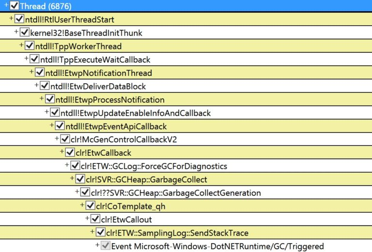
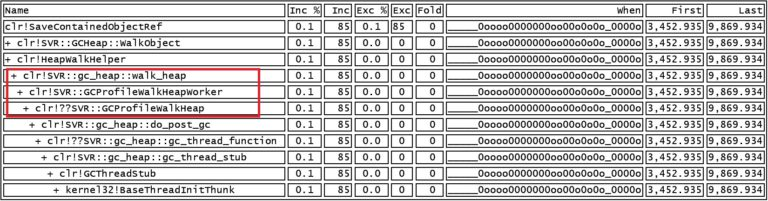

<h1>You Should Never See This Callstack in Production</h1>

A customer who just experienced some server outage asked us for help as they thought it was due to some very long GC pauses. I thought this diagnostics exercise might be useful for other folks as well so I am sharing it with you.

We had them collect a GCCollectOnly trace which showed there were some very long induced gen2 blocking GCs. And they are using Server GC which means we wanted stacks for the GCTrigger event which would show us exactly who induced these GCs. For Server GC the GCStart event is actually fired on one of the Server GC threads which would mean it’s not useful for figuring out who triggered the GC so we have this GCTrigger event to help exactly with that. However GCCollectOnly traces do not include stacks for CLR events so we asked them to collect some more traces for us with this perfview command line:

PerfView.exe /nogui /accepteula /BufferSizeMB:4096 /CircularMB:2000 /CollectMultiple:3 /StopOnGcOverMsec:3000 /DelayAfterTriggerSec:0 /KernelEvents:Memory,VirtualAlloc,Default /Process:”w3wp” /OnlyProviders:”ClrPrivate:1:5,Clr:0x40000001:5″ /NoRundown /NoNGenRundown /NoClrRundown /Merge:true /Zip:true collect

Yes I know it’s a very long command so let me break it down for you. I am intentionally putting things on separated lines so it’s easier to read –

Collect a trace with default kernel events + some memory events (specified with /KernelEvents:Memory,VirtualAlloc,Default – Default is there for things like being able to decode process names so you don’t get a trace where each process is only indicated by its process ID and it also includes the CPU sample events which we want in this case as we’d like to see which part of the work is expensive in GC); since we are collecting a trace to diagnose GC problems we are generally also interested in the OS memory events)

and CLR GC events at verbose level with stacks for the public GC events (specified with /OnlyProviders:”ClrPrivate:1:5,Clr:0x40000001:5″ – keyword 1 for both CLR public and private providers means GC and the 0x40000000 in the Clr public provider means collect stacks for those events. We do this so we get stacks with the GCTriggered event)

and when you detect a GC longer than 3s (specified with /StopOnGcOverMsec:3000)

in the w3wp.exe process (specified with /Process:”w3wp”, note that you specify w3wp, not w3wp.exe here)

stop the trace immediately when you detect that long GC (specified with /DelayAfterTriggerSec:0)

don’t do any rundown events (specified with /NoRundown /NoNGenRundown /NoClrRundown)

merge and zip the trace (specified with /Merge:true /Zip:true. You should definitely do merge if you need to analyze the trace on a different machine. I can’t tell you how many times people have failed to do this and then couldn’t get symbols decoded and had to recollect the trace as they already detected the unmerged traces from the machine where they collected on)

and do that 3 times total (specified with /CollectMultiple:3)

So if you were to use it for your own purpose the args to change are

/StopOnGcOverMsec:3000 – replace 3000 with the pause (in ms) you want to stop the trace for

/Process:”w3wp” – replace w3wp with the .exe you want to detect the long GC pause in

When we got the trace GCStats showed that there was an induced full blocking GC in one of the w3wp processes that took 7.8 seconds! And to see what induced this GC, goto Events view and find the Microsoft-Windows-DotNETRuntime/GC/Triggered event (if you type “tri” in the Filter textbox it’ll filter to only events whose names have tri in them so you can quickly find this event). Click on it and it’ll display all the instances of that event in all processes. Find the process and the GC of interest. The “Rest” column for this event will say HasStack=”True” which means there’s a stack associated with this event and if you right click on the timestamp and do “Open any stacks” it’ll show you the stack for this event which will reveal what induced this GC:

This is saying that someone requested to walk the heap with ETW (this is one of the mechanisms Perfview uses for taking a heap snapshot).

Now it leaves the question why this GC was so long. To see what the GC is actually doing that takes so long, open the CPU stack view with the time range set to the beginning and ending of this GC (which you can get from the GCStats view). And it’s pretty clear what’s taking up the time. We are spending 6.6s in this method called clr!SVR::GCProfileWalkHeapWorker!

Normally do_post_gc should take very, very little time but in the case of someone actually requesting a heap walk, GCProfileWalkHeap would do a full blown walk of the heap which obviously can be very expensive. You should never seen this callstack in production (unless you are intentionally taking a heap snapshot but that should just be a one time thing, or at best once in a long while)! I’ve seen this happen a couple of times where folks were completely oblivious some tool was asking for this continuously and it of course made GC pauses very long.

So something was asking for GC heap walks (it was not due to the perfview I showed above as that doesn’t include the keywords for heap walk events). It turned out the team just deployed a diagnostics tool that was doing this. After getting rid of the tool they no longer saw these long induced full blocking GCs.

Curious readers would also notice that the When column shows fairly low CPU usage (click on ‘?’ for the When column to see an explanation how to interpret what you see here). It was because the tool also induced 2 back to back full blocking GCs in the other w3wp process at the same time which made each GC much slower. Very destructive tool 🙂

一位客户最近经历了一次服务器宕机，他们向我们求助，认为这是由于一些非常长的 GC 暂停引起的。我认为这次诊断练习对其他人也可能有帮助，因此我在这里分享给大家。

我们让他们收集了一个 GCCollectOnly 跟踪，结果显示有一些非常长的、由程序主动触发的第 2 代阻塞式 GC。而且他们使用的是 Server GC，这意味着我们需要 GCTrigger 事件的调用栈信息，这会告诉我们到底是谁触发了这些 GC。对于 Server GC，GCStart 事件实际上是在其中一个 Server GC 线程上触发的，这意味着它对于找出谁触发了 GC 并没有帮助，所以我们有这个 GCTrigger 事件来专门解决这个问题。然而，GCCollectOnly 跟踪不包括 CLR 事件的调用栈信息，因此我们要求他们使用以下 PerfView 命令行为我们收集更多跟踪数据：

bash
深色版本
PerfView.exe /nogui /accepteula /BufferSizeMB:4096 /CircularMB:2000 /CollectMultiple:3 /StopOnGcOverMsec:3000 /DelayAfterTriggerSec:0 /KernelEvents:Memory,VirtualAlloc,Default /Process:"w3wp" /OnlyProviders:"ClrPrivate:1:5,Clr:0x40000001:5" /NoRundown /NoNGenRundown /NoClrRundown /Merge:true /Zip:true collect
是的，我知道这是一个很长的命令，所以让我为你分解一下。我故意将内容分行显示，以便更容易阅读——

.   收集一个包含默认内核事件和一些内存事件的跟踪（通过 /KernelEvents:Memory,VirtualAlloc,Default 指定——Default 是为了能够解码进程名称，
这样你不会得到一个每个进程仅通过其进程 ID 表示的跟踪，并且它还包含我们在此情况下需要的 CPU 样本事件，因为我们希望看到 GC 的哪部分工作是最耗时的；
由于我们正在收集一个用于诊断 GC 问题的跟踪，我们通常也对操作系统内存事件感兴趣）。
.   收集详细级别的 CLR GC 事件，并为公共 GC 事件提供调用栈信息（通过 /OnlyProviders:"ClrPrivate:1:5,Clr:0x40000001:5" 
指定——关键词 1 对于 CLR 公共和私有提供程序意味着 GC，而 0x40000000 在 CLR 公共提供程序中意味着为这些事件收集调用栈。我们这样做是为了在 GCTriggered 事件中获取调用栈）。
.   当检测到超过 3 秒的 GC 时停止跟踪（通过 /StopOnGcOverMsec:3000 指定）。
在 w3wp.exe 进程中进行跟踪（通过 /Process:"w3wp" 指定，注意这里指定的是 w3wp，而不是 w3wp.exe）。
    在检测到长时间 GC 时立即停止跟踪（通过 /DelayAfterTriggerSec:0 指定）。
不执行任何 rundown 事件（通过 /NoRundown /NoNGenRundown /NoClrRundown 指定）。
合并并压缩跟踪文件（通过 /Merge:true /Zip:true 指定。如果你需要在另一台机器上分析跟踪文件，绝对应该合并文件。我无法告诉你有多少人因为没有这样做而导致无法解码符号，最终不得不重新收集未合并的跟踪文件）。
总共执行 3 次（通过 /CollectMultiple:3 指定）。
如果你要将其用于自己的目的，需要更改的参数是：

/StopOnGcOverMsec:3000：将 3000 替换为你希望停止跟踪的暂停时间（以毫秒为单位）。
/Process:"w3wp"：将 w3wp 替换为你希望检测长时间 GC 暂停的 .exe 文件名。
    当我们收到跟踪文件后，GCStats 显示在其中一个 w3wp 进程中有一个由程序主动触发的全阻塞 GC，耗时 7.8 秒！为了查看是什么触发了这个 GC，转到“事件视图”，找到 Microsoft-Windows-DotNETRuntime/GC/Triggered 事件（如果你在过滤文本框中输入“tri”，它将只显示名称中包含“tri”的事件，这样你可以快速找到这个事件）。点击它，它将显示所有进程中该事件的所有实例。找到感兴趣的进程和 GC。此事件的“Rest”列会显示 HasStack="True"，这意味着此事件有一个调用栈关联。如果你右键点击时间戳并选择“Open any stacks”，它将显示此事件的调用栈，揭示是什么触发了这个 GC：

这表明有人请求通过 ETW 遍历堆（这是 PerfView 用于拍摄堆快照的机制之一）。

现在的问题是为什么这个 GC 如此之长。为了查看 GC 实际上在做什么导致了这么长的时间，打开 CPU 堆栈视图，并将时间范围设置为这个 GC 的开始和结束时间（可以从 GCStats 视图中获得）。很明显是什么占用了时间。我们在名为 clr!SVR::GCProfileWalkHeapWorker 的方法中花费了 6.6 秒！

通常情况下，do_post_gc 应该花费非常少的时间，但在有人实际请求堆遍历时，GCProfileWalkHeap 会进行全面的堆遍历，这显然可能非常昂贵。你应该永远不会在生产环境中看到这个调用栈（除非你有意拍摄堆快照，但这应该只是一次性的，或者至少是非常罕见的情况）！我已经见过几次这种情况，有些人完全不知道某个工具正在持续请求这种操作，这当然会使 GC 暂停变得非常长。

所以，某些东西正在请求 GC 堆遍历（这不是由于我上面展示的 PerfView，因为它不包含堆遍历事件的关键字）。事实证明，团队刚刚部署了一个诊断工具，正是这个工具在做这件事。移除该工具后，他们不再看到这些长时间的、由程序主动触发的全阻塞 GC。

好奇的读者还会注意到，“When” 列显示的 CPU 使用率相对较低（点击“?” 查看如何解释此列中的内容）。这是因为该工具同时在另一个 w3wp 进程中诱导了两个连续的全阻塞 GC，这使得每个 GC 变得更加缓慢。真是个破坏性极强的工具 😊