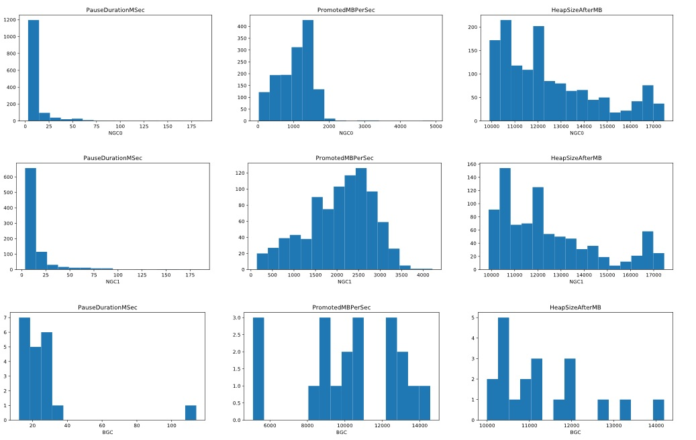
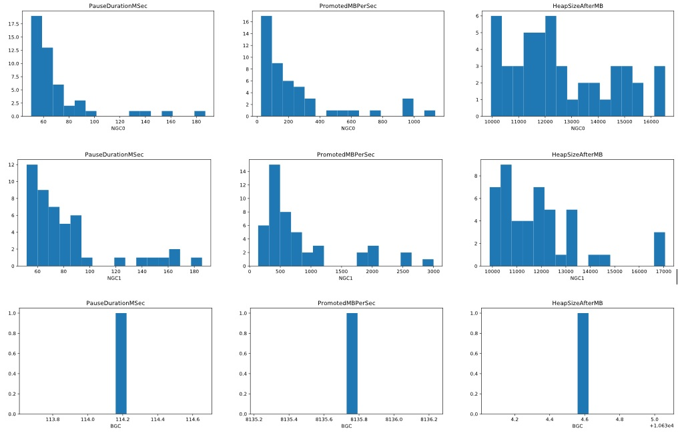
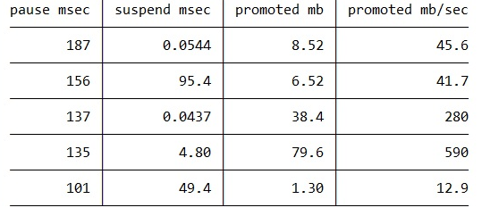
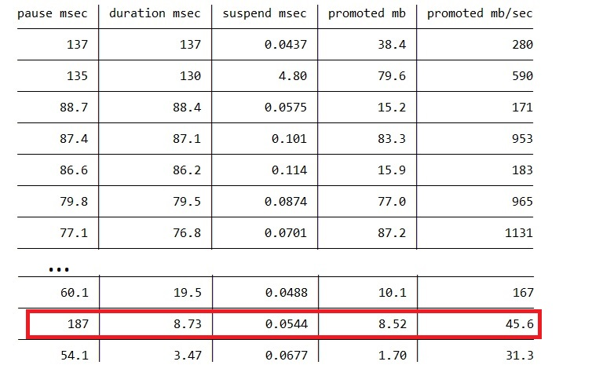
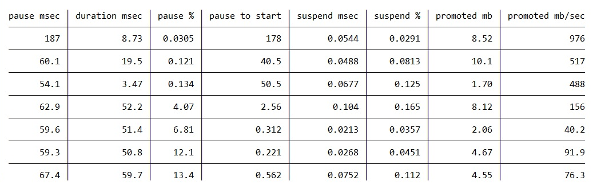

<h1>GC Perf Infrastructure – Part 0</h1>

In this blog entry and some future ones I will be showing off functionalities that our new GC perf infrastructure provides. Andy and I have been working on it (he did all the work; I merely played the consultant role). We will be open sourcing it soon and I wanted to give you some examples of using it and you can add these to your repertoire of perf analysis techniques when it’s available.

The general GC perf analysis flow on a customer scenario usually goes like this –

1) get a perf trace (ETW trace on Windows and event trace on Linux);

2A) if the customer has no complains and just wanted to see if they can improve things, we first get a general idea of things and see if/how they can be improved or

2B) if the customer does have specific complains (eg, long GC pauses, or too much memory used) we look for things that could cause them.

Of course, as any experienced perf person would know, perf analysis can vary greatly from one case to the next. You look at some data to get some clues to identify the suspicious areas and focus on those areas and get more clues…and usually make incremental progress before you get to the root cause.

To give some context, for data we get from trace, we have a library named TraceEvent that parses it into TraceGC objects. Since GC is per process, each process (that observed at least one GC) will get its list of these TraceGC objects. And the TraceGC type includes information on this GC such as

Basic things which are read directly from some GC event’s fields like Number (index of this GC), Generation (which generation this GC collected), PerHeapHistories (which includes a lot of info such as what condemned reasons this heap incurred, the generation data for each generation for this heap)
Processed info like PauseDurationMSec (for ephemeral GCs this is the difference between the timestamp of the SuspendEEStart event and the RestartEEStop event);
Info that gets light up when you have the additional events, eg, GCCpuMSec if you have CPU samples collected in the trace;
So given a basic GC trace there’s already a ton of info you can get. We do some processing in TraceEvent and a perf analysis means looking at info these TraceGC objects give you in really any number of ways.

If we have a big trace, the time that it took to parse the trace to get these TraceGC objects can be very long. And if I change my analysis code I’d have to start my analysis process again which means I’d have to parse the trace again. This seemed very inefficient. I started searching for options that could persist the TraceGC objects and I can just modify my code to consume them without having to reprocess the trace. And I found Jupyter Notebook which allows you to edit python code in individual cells but the results from them persist in memory and can be used by any other cells. And I found pythonnet which allows you to interop with a c# lib from python. This means I could persist the TraceGC objects in memory and edit the code that I want to look at any of these objects in any way I desire and don’t need to reprocess the trace at all. This along with the nice charting capability from python gave me exactly what I needed. So what I would do is to have one cell that just did the trace processing with all the resulting TraceGC objects, and other cells for various ways to look at info in these objects and edit them whenever I needed.

This was several years ago and I’ve been using it since. When Andy joined the team and started working on a new GC perf infra I asked him to adapt this as part of our infra. And today I looked at a trace with him and below is what we did.

In this case I just got the trace from a customer to see if we can find anything can be improved by something the customer can do or we did but in a release the customer hasn’t upgraded to, or we are doing/planning to do. To start with, we looked at 3 metrics – individual GC pause times (PauseDurationMSec), GC speed PromotedMBPerSec(ie, # of MB GC promoted / (PauseDurationMSec / 1000)) and  heap size in MB after each GC (HeapSizeAfterMB), just to get a general idea. We used the histogram charts for these:

 

*NGC means NonConcurrent GC, I didn’t want to call it BGC (Blocking GC) because we already have BGC mean Background GC.

If you look at the PauseDurationMSec charts for gen0 GCs (NGC0), gen1 GCs (NGC1) and BGCs (there were no full blocking GCs in this trace), most of them were in the range of a few to 20ms. But there are definitely some longer ones, eg some that are between 75 and 100ms in the NGC0 chart. And right off the bat we see some outliers for BGC – most of them are < 40ms but then there are some > 100ms! And it’s hard to see on the charts but there are actually some thin blue lines in the > 100ms range in both the NGC0 and NGC1 charts.

Since we are using Jupyter, we just changed the code in the cell for this and only showed GCs with the PauseDurationMSec > 50ms and redrew the charts – now it’s very clear there are some ephemeral GCs > 100ms pauses and we can see the 1 long BGC pause is 114.2ms.

 

And we can see the GC speed (the PromotedMBPerSec charts) for many of these are low. In the NGC0 chart most of the GCs are on the left hand side with the lowest speed.

If the long GCs’s PromotedMBPerSec was not so low it would mean they simply had a lot more memory to promote which would indicate a GC tuning problem – one very likely reason would be we are not setting the allocation budgets correctly.

But since that’s not the case we wanted to see why these GC’s speed was so low – we spent a long time paused but GC was not able to do work at its normal speed.

Let’s concentrate on the gen0 GCs (NGC0) first as a starting point. We know the way PauseDurationMSec is calculated so it consists of suspending EE (SuspendDurationMSec)+ actual GC work + resuming EE. Resuming the EE generally takes very little time so I’ll not look at it first. I wanted to see if suspension was too long. So we looked at NGC0’s pause and suspension with our table printing function. Since it’s so easy we’ll throw in the total promoted mb and the GC speed and let’s sort by PauseDurationMSec (highest first):

 

“pause msec” is PauseDurationMSec.

“suspend msec” is SuspendDurationMSec.

“promoted mb” is PromotedMB for this GC.

(I’m only showing the top few for brevity)

Right away we see some long suspension times – the GCs that took 156ms and 101ms, spent 95.4ms and 49.4ms in suspension respectively. So that definitely shows a suspension issue which means the suspension in EE had trouble suspending the managed threads. But the other GCs, like the longest one that took 187ms spent very little time in suspension.

We do have another field in the TraceGC class called DurationMSec which is the difference between the timestamp for the GCStart event and the GCStop event. From the first glance this should just be PauseDurationMSec – suspending EE – resuming EE. Almost – there’s a bit of work we have to do between SuspendEEStop and GCStart, and between GCStop and RestartEEStart. So if things work as expected, (PauseDurationMSec – DurationMSec) should be almost the same as (suspending EE + resuming EE). We changed the code again to add a DurationMSec column (“duration msec”) and we sort by that column

 

The longest GC (187ms) has only 8.73ms DurationMSec! And Suspend only took 0.0544ms. So there’s a huge difference between PauseDurationMSec and DurationMSec, not accounted by the suspension cost.

We modified the code again to add a few more columns, mainly the “pause to start” column which is the difference between the timestamp of SuspendEEStart and GCStart so it includes the suspension time. We also calculate a “pause %” column which is (“suspend msec” / “pause to start” * 100) and a “suspend %” column which is (“suspend msec” / “pause msec” * 100). Also we changed the “promoted mb/sec” column to use DurationMSec instead of PauseDurationMSec. Now some rows in the table change very drastically. The table is sorted by the “pause %” column.

 

The GC that took 187ms spent 178ms from SuspendEEStart to GCStart!!! And of course the GC speed (promoted mb/sec) is now a lot higher.

This is enough evidence to tell us that the GC threads are getting severely interfered (suspension is not the only part that was affected), could be from other processes or other threads in this process. We’d need to collect more events to diagnose further.

 
https://devblogs.microsoft.com/dotnet/gc-perf-infrastructure-part-0/

在这篇博客以及未来的几篇中，我将展示我们新的 GC 性能基础设施所提供的功能。我和 Andy 一直在为此工作（他完成了所有的工作，我只是担任顾问的角色）。我们很快会将其开源，我想通过一些例子向你们展示如何使用它，这样当它可用时，你可以将其加入到你的性能分析工具集中。

通常情况下，在客户场景下的 GC 性能分析流程如下：

获取性能跟踪数据（在 Windows 上是 ETW 跟踪，在 Linux 上是事件跟踪）；
2A) 如果客户没有抱怨，只是想看看是否可以改进某些方面，我们会先对整体情况有一个大致的了解，并查看是否有改进的空间或如何改进；

2B) 如果客户确实有具体的抱怨（例如，GC 暂停时间过长或内存使用过多），我们会寻找可能导致这些问题的原因。

当然，任何有经验的性能分析人员都知道，性能分析可能因案例而异。你需要查看一些数据以获取线索，识别可疑区域，并专注于这些区域获取更多信息……通常需要逐步进展才能找到根本原因。

为了提供一些背景信息，从跟踪数据中获取的数据由一个名为 TraceEvent 的库解析为 TraceGC 对象。由于 GC 是按进程进行的，每个进程（至少观察到一次 GC 的进程）都会有自己的 TraceGC 对象列表。TraceGC 类型包含有关此次 GC 的信息，例如：

基本信息，直接从某些 GC 事件字段读取，如编号（此 GC 的索引）、代数（此次 GC 收集的代数）、PerHeapHistories（包括堆的判罪原因、每一代的数据等）。
处理后的信息，如 PauseDurationMSec（对于临时代 GC，这是 SuspendEEStart 事件和 RestartEEStop 事件之间的时间差）。
当存在额外事件时才会提供的信息，例如如果有 CPU 样本收集，则会有 GCCpuMSec。
因此，即使是一个基本的 GC 跟踪数据，也可以获取大量信息。我们在 TraceEvent 中进行了一些处理，性能分析意味着以任意方式查看这些 TraceGC 对象提供的信息。

如果跟踪数据很大，解析跟踪数据以获取这些 TraceGC 对象所需的时间可能会非常长。而且如果我更改了我的分析代码，我就必须重新开始分析过程，这意味着我必须再次解析跟踪数据。这似乎非常低效。我开始寻找可以持久化 TraceGC 对象的选项，这样我可以修改我的代码来消费它们，而无需重新处理跟踪数据。我发现了 Jupyter Notebook，它允许你在单独的单元格中编辑 Python 代码，但其结果会保留在内存中，并可被其他单元格使用。我还发现了 pythonnet，它允许你从 Python 中与 C# 库互操作。这意味着我可以将 TraceGC 对象保留在内存中，并随时修改代码以查看这些对象的任何信息，而无需重新处理跟踪数据。再加上 Python 提供的良好绘图功能，这正是我所需要的。因此，我会创建一个单元格专门用于跟踪处理并生成所有的 TraceGC 对象，而其他单元格则用于以各种方式查看这些对象中的信息，并随时进行修改。

几年前我就开始使用这种方法，并一直沿用至今。当 Andy 加入团队并开始开发新的 GC 性能基础设施时，我请他将这种方法纳入我们的基础设施中。今天，我和他一起查看了一个跟踪数据，以下是我们的操作。

在这个案例中，我从客户那里获取了跟踪数据，看看是否可以通过客户可以采取的措施或我们已经实现但客户尚未升级的功能，或者我们正在做或计划做的事情来改进性能。首先，我们查看了三个指标——单个 GC 暂停时间（PauseDurationMSec）、GC 速度（PromotedMBPerSec，即 GC 提升的 MB 数 / （PauseDurationMSec / 1000））和每次 GC 后的堆大小（以 MB 为单位，HeapSizeAfterMB），只是为了获得一个总体概念。我们使用直方图图表来展示这些数据：

*NGC 表示非并发 GC，我不想称之为 BGC（阻塞 GC），因为我们已经将 BGC 定义为后台 GC。

如果你查看 gen0 GC（NGC0）、gen1 GC（NGC1）和后台 GC（BGC）的 PauseDurationMSec 图表（此跟踪数据中没有完全阻塞的 GC），大多数都在几毫秒到 20 毫秒的范围内。但确实有一些较长的暂停时间，例如 NGC0 图表中的一些在 75 到 100 毫秒之间的暂停。并且我们可以立即看到 BGC 中的一些异常值——大多数都小于 40 毫秒，但有些大于 100 毫秒！虽然在图表上很难看到，但在 NGC0 和 NGC1 图表中 > 100 毫秒的范围内实际上有一些细蓝线。

由于我们使用的是 Jupyter，我们只需更改该单元格中的代码，仅显示 PauseDurationMSec > 50 毫秒的 GC 并重新绘制图表——现在可以清楚地看到一些超过 100 毫秒的临时代 GC 暂停，我们可以看到 1 次长的 BGC 暂停时间为 114.2 毫秒。

我们还可以看到许多这些 GC 的速度（PromotedMBPerSec 图表）很低。在 NGC0 图表中，大多数 GC 都在左侧，具有最低的速度。

如果长时间 GC 的 PromotedMBPerSec 不那么低，那就意味着它们只是需要提升更多的内存，这表明存在 GC 调优问题——一个非常可能的原因是我们没有正确设置分配预算。

但由于情况并非如此，我们想知道为什么这些 GC 的速度如此低——我们暂停了很长时间，但 GC 并没有以正常速度完成工作。

让我们先从 gen0 GC（NGC0）开始作为切入点。我们知道 PauseDurationMSec 的计算方式，因此它包括暂停 EE（SuspendDurationMSec）+ 实际 GC 工作 + 恢复 EE。恢复 EE 通常花费很少时间，所以我先不看这部分。我想看看暂停时间是否过长。因此，我们使用表格打印函数查看 NGC0 的暂停时间和暂停持续时间。既然这么容易，我们还添加了总提升的 MB 和 GC 速度，并按 PauseDurationMSec 排序（从高到低）：

“pause msec” 是 PauseDurationMSec。

“suspend msec” 是 SuspendDurationMSec。

“promoted mb” 是此次 GC 的 PromotedMB。

（为简洁起见，这里只显示前几行）

我们立即看到了一些较长的暂停时间——耗时 156 毫秒和 101 毫秒的 GC 分别花费了 95.4 毫秒和 49.4 毫秒用于暂停。这显然表明存在暂停问题，意味着 EE 在暂停托管线程时遇到了困难。但对于其他 GC，例如最长的那个耗时 187 毫秒的 GC，暂停时间非常短。

TraceGC 类中还有一个名为 DurationMSec 的字段，它是 GCStart 事件和 GCStop 事件之间的时间差。乍一看，这应该只是 PauseDurationMSec - 暂停 EE - 恢复 EE。几乎如此——但我们还需要在 SuspendEEStop 和 GCStart 之间，以及 GCStop 和 RestartEEStart 之间做一些工作。因此，如果一切按预期运行，PauseDurationMSec - DurationMSec 应该几乎等于（暂停 EE + 恢复 EE）。我们再次修改代码，添加了一个 DurationMSec 列（“duration msec”），并按该列排序：

最长的 GC（187 毫秒）只有 8.73 毫秒的 DurationMSec！而暂停时间仅为 0.0544 毫秒。因此，PauseDurationMSec 和 DurationMSec 之间的差异巨大，且无法用暂停成本解释。

我们再次修改代码，添加了几列，主要是“pause to start”列，它是 SuspendEEStart 和 GCStart 时间戳之间的差值，因此包括了暂停时间。我们还计算了一个“pause %”列（"suspend msec" / "pause to start" * 100）和一个“suspend %”列（"suspend msec" / "pause msec" * 100）。此外，我们将“promoted mb/sec”列改为使用 DurationMSec 而不是 PauseDurationMSec。现在表格中的某些行发生了显著变化。表格按“pause %”列排序。

耗时 187 毫秒的 GC 从 SuspendEEStart 到 GCStart 花费了 178 毫秒！！当然，GC 速度（promoted mb/sec）现在要高得多。

这足以证明 GC 线程受到了严重干扰（暂停并不是唯一受影响的部分），可能是来自其他进程或其他线程的干扰。我们需要收集更多事件以进一步诊断。