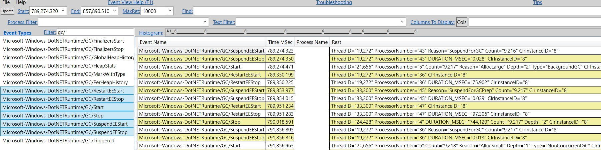

<h1>Work flow of diagnosing memory performance issues – Part 1</h1>

In this blog post I’ll talk a bit about contributing to PerfView and then continue with the GCStats analysis. You can skip to the analysis part directly if you like.

One of the frustrating things for me when it comes to tooling is there are a lot of memory perf tools out there but very few are targeting the common types of customers I normally work with. Every tool does the basics; very few do intermediate and advanced analysis. I know folks have complained about the usability of PerfView – and I do think some of the complaints are valid. None the less I love PerfView because it’s often the only tool that can get the job done. I hope folks understand that 1) we have very limited resource for PerfView (we don’t have a whole tooling team like in the Visual Studio org; we have part time from a few individuals) so it’s hard to satisfy nearly all user requests; 2) when it comes to advanced analysis, since it can be so diverse, it naturally means the usability is not going to be as straightforward – when there are so many ways to look at things, the permutation quickly becomes very large.

Contributing to something like PerfView is an excellent way to contribute to .NET core. It doesn’t have as steep of a learning curve as the runtime itself but your contribution could potentially save people a ton of time. You can start by cloning the repo and building it. And then you can step through the code – IMO if you could actually step through the code, this is always the best way to understand something new. The code that affects what I talk about here mostly lives in 2 files – src\TraceEvent\Computers\TraceManagedProcess.cs and src\PerfView\GcStats.cs. If you search for things like Clr.EventName (eg, Clr.GCStart, Clr.GCStop), that’s where the events are analyzed (you don’t have to be concerned with the actual parsing the trace part – that’s handled elsewhere). So the GC analysis done in this file is what we call our GLAD (GC Latency Analysis and Diagnostics) library. And GcStats.cs uses it to display what you see in the GCStats view which is an html file. If you’d like to display the GC related info in your own tools, GCStats.cs would serve as an excellent example how to use GLAD.

Continuing the analysis
In the last post we talked about collecting a GCCollectOnly trace and inspecting the GCStats view in PerfView that’s enabled by the GC events collected. And I should note that you can do this on Linux as well with dotnet-trace. From its doc: one of the built in profiles it offers is what’s equivalent to the /GCCollectOnly arg to PerfView’s collect command:

Copy
 --profile

   [omitted]

   gc-collect   Tracks GC collection only at very low overhead
You can collect a trace with dotnet-trace on Linux with this commandline

dotnet trace collect -p <pid> -o <outputpath> --profile gc-collect

and view it on Windows with PerfView. The only difference from the user’s POV when you view the GCStats view is, with the trace collected on Windows you will see all the managed processes whereas the trace collected on Linux only has the process with the pid you specified.

In this blog post I will focus on the tables you see in GCStats. I’m showing an example here. The 1st table for a process is the “GC Rollup By Generation” table –

在上一篇文章中，我们讨论了如何收集 GCCollectOnly 跟踪数据，并在 PerfView 中检查由收集的 GC 事件启用的 GCStats 视图。需要说明的是，你也可以在 Linux 上使用 dotnet-trace 完成这一操作。根据其文档，它提供的内置配置文件之一等同于 PerfView 的 collect 命令中的 /GCCollectOnly 参数：

dotnet trace collect -p <pid> -o <outputpath> --profile gc-collect
然后在 Windows 上使用 PerfView 查看跟踪数据。从用户的视角来看，当你查看 GCStats 视图时，唯一的区别是：在 Windows 上收集的跟踪数据会显示所有托管进程，而在 Linux 上收集的跟踪数据只包含你指定 PID 的进程。

在本文中，我将重点介绍你在 GCStats 中看到的表格。这里展示一个例子。对于一个进程，第一个表格是“按代汇总 GC”表（GC Rollup By Generation）。

|        |       | GC	     |Rollup	   |By	              |Generation	|				 |                   |                      |            |         |
| Gen    | Count | Max Pause | Max Peak MB | Max Alloc MB/sec | Total Pause | Total Alloc MB | Alloc MB/ MSec GC | Survived MB/ MSec GC | Mean Pause | Induced |
|--------|-------|-----------|-------------|------------------|-------------|----------------|------------------|---------------------|------------|---------|
| ALL    | 130   | 173.2     | 13,073.7    | 1,131.804        | 4,336.1     | 167,910.9      | 38.7             | 24.686              | 33.4       | 0       |
| 0      | 60    | 51.0      | 12,992.7    | 806.553          | 1,410.8     | 88,958.3       | 0.0              | ∞                   | 23.5       | 0       |
| 1      | 62    | 48.3      | 13,073.7    | 422.930          | 1,585.0     | 77,866.1       | 0.0              | ∞                   | 25.6       | 0       |
| 2      | 8     | 173.2     | 12,730.3    | 1,131.804        | 1,340.3     | 1,086.5        | 0.0              | 4,169.493           | 167.5      | 0       |

I ignore the Alloc MB/MSec GC and Survived MB/MSec GC columns – they existed before I started working on PerfView and it’d be good to fix these up to have them make more sense but I never got around to.

Now, if you were doing a general analysis, meaning there’s no immediate complaints and you just want to see if there’s anything to improve, you can start with this rollup table.

If we look at the table above, right off the bat we notice that gen2 mean pause is a lot larger than gen0/1 GCs’. We can guess that these gen2s are probably not blocking because the Max Peak MB is around 13GB and if we were to go through all that memory it’s probably going to take more than 167ms. So these are likely BGCs and that’s confirmed by the “Gen 2 for pid: process_name” table below the rollup table (I deleted some columns from the table so it’s not too wide) –

| GC Index | Pause Start | Trigger Reason | Gen | Suspend MSec | Pause MSec | Peak MB | After MB | Ratio Peak/After | Promoted MB | Gen2 MB | Gen2 Survival | Gen2 Frag | LOH MB | LOH Survival | LOH Frag | Rate % | Suspend % | Pause Rate % |
|----------|-------------|----------------|-----|--------------|------------|---------|----------|-----------------|-------------|---------|---------------|-----------|--------|--------------|----------|--------|-----------|--------------|
| 9101     | 27,487.00   | AllocLarge     | 2B  | 0.12         | 161.67     | 12,015.06 | 11,955.12 | 1.01            | 6,227.54    | 4,319.97 | 97            | 13.19     | 7,211.27 | 29           | 65.91    |        |           |              |
| 9118     | 152,419.36  | AllocLarge     | 2B  | 0.1          | 169.81     | 12,153.84 | 12,108.31 | 1               | 6,245.36    | 4,319.97 | 98            | 12.81     | 7,213.29 | 29           | 66.05    |        |           |              |
| 9134     | 269,587.92  | AllocLarge     | 2B  | 0.061        | 165.74     | 12,730.31 | 11,772.57 | 1.08            | 6,271.16    | 4,319.97 | 97            | 12.35     | 7,142.26 | 29           | 65.67    |        |           |              |
| 9150     | 388,039.73  | AllocLarge     | 2B  | 0.045        | 161.05     | 12,367.15 | 12,263.51 | 1.01            | 6,255.25    | 4,319.97 | 97            | 12.97     | 7,203.40 | 29           | 65.88    |        |           |              |
| 9166     | 490,877.35  | AllocLarge     | 2B  | 0.047        | 172.56     | 12,217.70 | 12,180.20 | 1               | 6,255.52    | 4,320.00 | 97            | 12.57     | 7,233.93 | 29           | 66.02    |        |           |              |
| 9183     | 587,126.19  | AllocLarge     | 2B  | 0.039        | 171.76     | 12,026.77 | 11,921.34 | 1.01            | 6,253.19    | 4,320.00 | 97            | 12.93     | 7,174.79 | 29           | 65.64    |        |           |              |
| 9200     | 688,030.60  | AllocLarge     | 2B  | 0.132        | 164.5      | 12,472.19 | 12,487.77 | 1               | 6,257.01    | 4,320.00 | 97            | 12.86     | 7,247.72 | 29           | 66       |        |           |              |
| 9217     | 789,274.32  | AllocLarge     | 2B  | 0.066        | 173.21     | 12,182.76 | 12,200.48 | 1               | 6,268.88    | 4,320.00 | 97            | 12.84     | 7,211.30 | 29           | 65.63    |        |           |              |

2B means generation 2 and Background. If you want to see what other combinations there are, simply hover over the column header that says “Gen” and you will see this text:

N=NonConcurrent, B=Background, F=Foreground (while background is running) I=Induced i=InducedNotForced

So for gen2 this could also be 2N, 2NI, 2Ni or 2Bi. If you are using GC.Collect to induce a GC, there’s 2 overloads that take this parameter –

Copy
bool blocking
Unless you specify false for this parameter it means the induced GC is always going to be blocking. That’s why there’s no 2BI.

The rollup table always says there’s 0 induced GCs. But if this is not 0, especially if this is a fairly significant number compared to the total number of GCs, it’s always a good idea to figure out who’s inducing these GCs. This is described in this blog entry.

So we know these are all BGCs but for BGC these pauses are very long! Note that I show the pause for BGC as one pause but it really consists of 2 pauses. This picture from the GC MSDN page shows the 2 pauses during one BGC (where the blue arrows are). But the pause time you see in GCStats is the sum of these 2 pauses. The reason was the initial pause is usually very short (the arrows in the picture are merely for illustration purposes – they do not represent how long the time periods actually are). In this case we want to take a look how long each individual pauses are – I’m thinking to just provide the individual BGC pause info in GLAD but before that happens, this is how you can figure out for yourself.

In this blog entry I described the actual event sequence of a BGC. So we are really just looking for the 2 SuspendEE/RestartEE event pairs. To do this you can open the Events view in PerfView and start from the “Pause Start”. Let’s take GC#9217 as an example, its Pause Start is 789,274.32 which you can enter into the “Start” textbox. For Filter type “gc/” to filter to just the GC events, and select the SuspendEE/RestartEE/GCStart/GCStop events and press enter. Below is an example picture of what you would see at this point (I erased the process name for privacy reasons) –

BGC pauses

If you select the timestamp for the 1st SuspendEEStart and the 1st RestartEEStop, this is the 1st pause. We can see the status bar of this view shows you the diff of these 2 timestamps is 75.902. That’s very long – in general the initial pause should be no longer than a couple/few ms. At this point you could basically hand this over to me because this is totally not by design. However, if you are interested to diagnose further on your own, the next step would be to capture a trace with more events to show us what’s going on during this suspension period. Usually we capture a trace with CPU sample events + GC events. The CPU samples showed us clearly what the culprit was which was not actually in GC and was in fact something else in the runtime which we have since fixed and this perf issue only shows up when you have many modules in your process (in this particular case the customer had a few thousand modules).

The 2nd pause for this BGC starts with a SuspendEEStart event whose reason is “SuspendForGCPrep”, different from the 1st SuspendEEStart whose reason is “SuspendForGC”. When suspension is done for GC purpose these are the only 2 possible reasons and the “SuspendForGCPrep” is only used during BGC after the initial pause. Normally there are only 2 pauses in one BGC but if you enable events with the GCHeapSurvivalAndMovementKeyword, you will be adding a 3rd pause during a BGC because in order to fire these events the managed threads have to be pauses. If that’s the case the 3rd pause would also have the “SuspendForGCPrep” reason and is usually much longer than the other 2 pauses because it takes long time to fire events if you have a big heap. I have seen this quite a few times when folks didn’t even need those events were seeing an artificially long pause for BGC due to this exact reason. You might ask why would someone accidently collect these events if they didn’t need them. It’s because these are included in the Default when you collect the runtime events (you can see which keywords Default includes in src\TraceEvent\Parsers\ClrTraceEventParser.cs, just search for default. And you can see there are many keywords included in Default). In general I think PerfView’s philosophy is the default should collect enough events for you to do all sorts of investigations. And in general this is a good policy as you may not have another repro. But you need to be able to tell what’s caused by collecting the events themselves and what’s due to the product. This of course assumes if you can afford to collect this many events. Sometimes it’s definitely not the case which is why I generally ask folks to start with lightweight tracing to indicate to us whether there is a problem and if so what other events we should collect.

Another thing we notice from the gen2 table is all of the BGCs were triggered by AllocLarge. Possible Trigger reasons are defined as GCReason in src\TraceEvent\Parsers\ClrTraceEventParser.cs:

2B 表示第 2 代（Generation 2）和后台（Background）GC。如果你想查看其他组合，只需将鼠标悬停在标有“Gen”的列标题上，你会看到以下文本：

深色版本
N=NonConcurrent, B=Background, F=Foreground (while background is running) I=Induced i=InducedNotForced
因此，对于第 2 代 GC，也可能是 2N, 2NI, 2Ni 或 2Bi。如果你使用 GC.Collect 来触发 GC，有两个重载接受此参数：

csharp
深色版本
bool blocking
除非你将此参数显式设置为 false，否则触发的 GC 总是阻塞式的。这就是为什么没有 2BI 的原因。

汇总表总是显示诱导的 GC 数量为 0。但如果这个数字不是 0，尤其是如果它相对于总的 GC 数量是一个相当显著的数字，那么弄清楚是谁诱导了这些 GC 总是一个好主意。这一点在这篇博客文章中有详细描述。

背景 GC 的暂停时间
我们知道这些都是后台 GC（BGC），但对于 BGC 来说，这些暂停时间非常长！需要注意的是，我在这里显示的 BGC 暂停时间实际上是由两个暂停组成的。下图来自 MSDN 的 GC 页面，展示了一次 BGC 中的两次暂停（蓝色箭头表示暂停的位置）。但在 GCStats 中看到的暂停时间是这两个暂停时间的总和。原因是初始暂停通常非常短（图中的箭头仅用于说明，并不代表实际的时间长度）。在这种情况下，我们希望查看每次单独暂停的时间——我正在考虑在 GLAD 中直接提供单独的 BGC 暂停信息，但在实现之前，你可以通过以下方法自行计算。

在本文中，我描述了 BGC 的实际事件序列。因此，我们只需要查找两对 SuspendEE/RestartEE 事件。为此，你可以在 PerfView 中打开“Events”视图，并从“Pause Start”开始。以 GC#9217 为例，其“Pause Start”时间为 789,274.32，你可以将其输入到“Start”文本框中。在过滤器中输入 gc/ 以仅筛选 GC 事件，并选择 SuspendEE/RestartEE/GCStart/GCStop 事件后按回车键。以下是此时你可能会看到的一个示例图片（出于隐私原因，我删除了进程名称）：

如果你选择第一个 SuspendEEStart 和第一个 RestartEEStop 的时间戳，这就是第一次暂停。我们可以看到该视图的状态栏显示这两个时间戳之间的差值为 75.902 毫秒。这非常长——一般来说，初始暂停不应超过几毫秒。此时，你可以基本上将问题交给我处理，因为这种情况完全不符合设计。然而，如果你有兴趣进一步自行诊断，下一步是捕获一个包含更多事件的跟踪数据，以显示在此挂起期间发生了什么。通常我们会捕获一个包含 CPU 样本事件 + GC 事件的跟踪数据。CPU 样本清楚地显示了罪魁祸首并不是 GC 本身，而是运行时中的其他部分（我们已经修复了这个问题），并且这种性能问题仅在你的进程中存在大量模块时才会出现（在这个特定案例中，客户的进程中包含几千个模块）。

第二次暂停
对于这次 BGC，第二次暂停从一个 SuspendEEStart 事件开始，其原因是 SuspendForGCPrep，这与第一次 SuspendEEStart 的原因 SuspendForGC 不同。当为了 GC 目的进行挂起时，只有这两种可能的原因，而 SuspendForGCPrep 仅在 BGC 的初始暂停之后使用。通常，一次 BGC 只有两个暂停，但如果你启用了带有 GCHeapSurvivalAndMovementKeyword 的事件，则会在 BGC 中添加第三个暂停，因为为了触发这些事件，托管线程必须被挂起。如果是这种情况，第三次暂停的原因也会是 SuspendForGCPrep，并且通常比其他两次暂停更长，因为如果你的堆很大，触发事件需要较长时间。我见过很多次这样的情况：即使人们不需要这些事件，由于启用了这些事件而导致 BGC 的暂停时间人为地变长。你可能会问，如果不需要这些事件，为什么会意外收集它们？这是因为这些事件包含在默认的运行时事件中（你可以在 src\TraceEvent\Parsers\ClrTraceEventParser.cs 中查看 Default 包含哪些关键字，只需搜索 default 即可。你会发现 Default 包含了许多关键字）。一般来说，PerfView 的设计理念是默认情况下收集足够的事件，以便你可以进行各种调查。通常这是一个很好的策略，因为你可能无法重现问题。但你需要能够区分是因为收集事件本身导致的问题，还是产品本身的问题。当然，这假设你可以负担得起收集这么多事件的成本。有时这显然不可行，这就是为什么我通常要求大家从轻量级跟踪开始，以指示我们是否有问题，以及如果有问题，我们应该收集哪些其他事件。

其他观察
从第 2 代表格中我们还注意到，所有的 BGC 都是由 AllocLarge 触发的。可能的触发原因在 src\TraceEvent\Parsers\ClrTraceEventParser.cs 中定义为 GCReason。

Copy
public enum GCReason
{
    AllocSmall = 0x0,
    Induced = 0x1,
    LowMemory = 0x2,
    Empty = 0x3,
    AllocLarge = 0x4,
    OutOfSpaceSOH = 0x5,
    OutOfSpaceLOH = 0x6,
    InducedNotForced = 0x7,
    Internal = 0x8,
    InducedLowMemory = 0x9,
    InducedCompacting = 0xa,
    LowMemoryHost = 0xb,
    PMFullGC = 0xc,
    LowMemoryHostBlocking = 0xd
}
The most common reason is AllocSmall which means your allocation on the SOH triggered this GC. AllocLarge means an LOH allocation triggered this GC. In this particular case the team was already aware they were doing a lot of LOH allocations – they just didn’t know they caused BGCs this frequently. If you look at the “Gen2 Survival Rate %” column you’ll notice that the surv rate for gen2 is very high (97%) but the “LOH Survival Rate %” is very low – 29%. This tells us that there are a lot of LOH allocations that are fairly short lived.

We do adjust the LOH budget based on the gen2 budget so for cases like this we don’t triggered too many gen2 GCs. If we wanted to have LOH surv rate to be higher we’d need to trigger BGCs more often than this. If you know your LOH allocations are generally temporary a good thing to do is to make the LOH threshold larger via the GCLOHThreshold config.

That’s all for today. Next time we’ll talk more about tables in the GCStats view.

 
https://devblogs.microsoft.com/dotnet/work-flow-of-diagnosing-memory-performance-issues-part-1/