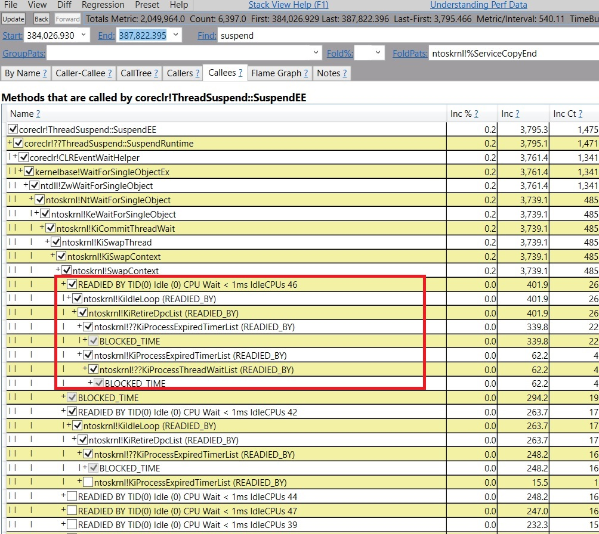
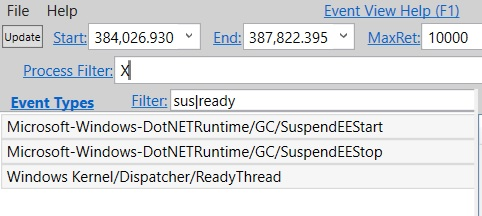
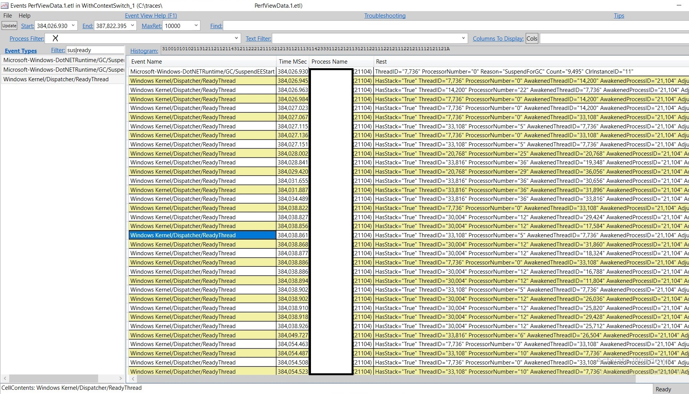
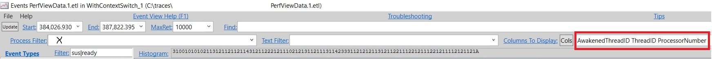
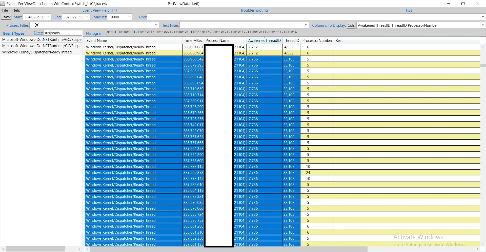
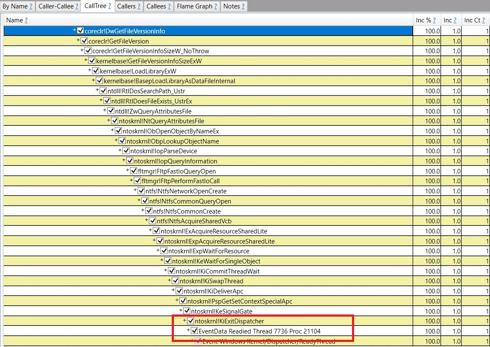

<h1>Work flow of diagnosing memory performance issues – Part 2</h1>
In this blog post I’ll talk a bit about how to spend time wisely and then continue with the analysis. Originally I was going to delve deeper into the GCStats view but I actually just debugged a long suspension issue that I wanted to share 'cause it shows some general ideas of what to do when you hit problems during an analysis. You can skip to the analysis part directly if you like.

PerfView isn’t just to collect traces. More importantly, it’s to analyze traces. I’ve come across folks again and again where they collected a trace and that’s the end of usage of PerfView. I would really strongly encourage you to actually use it also as an analysis tool. There’s already an extensive help built in in PerfView. Obviously the main reason why I’m writing this blog series is to also help you with that but with more focus on the memory side. I try to explain why I do things the way I do – the end goal is to help you to get ideas of approaches on how to figure out perf problems; not to list exhaustively all the problems you might hit which would be completely unrealistic.

My philosophy is always that you should be wise about what you spend your time on. We are all very busy with endless tasks to do. I also get that many of us are very independent people and love to figure things out on our own. So how much work do you do on your own before you ask someone for help? These are a couple of rules I go by –

be generous about spending time to acquire knowledge and skills that will be used often later. If I'm looking at a problem in an area that I will unlikely ever need to look at again, I tend to ask for help sooner 'cause I know the knowledge I acquire here will likely just be used once. But if it's an area I know I will need to solve problems in again, I spend as much time as I can to understand it.
if I have an urgent problem and there's someone I know who will mostly likely know the answer right off the bat I would ask them for help sooner. And if it's something I think I'll need to know later I will then spend time to understand more details after I get the problem taken care of first ('cause other teams might be waiting on a solution). When I do ask for help, I give the other person a detailed description of the problem and details of all the debugging I've done so far, to save them time to ask for this info.
If you are someone who's a user of the GC, spending a lot of time knowing the nitty gritty details of the GC is probably not the best use of your time; but if you are responsible for analyzing the performance of the product you work on, spending time to learn a few fundamentals of memory and how to do memory analysis benefits immensely – it will give you a lot of autonomy and having autonomy is a great thing 😃

Continuing the analysis
In Part 0 I mentioned I usually request 2 traces to start the investigation. The 2nd trace is to get CPU samples and some other general events like disk/network IO too:

PerfView /nogui /accepteula /KernelEvents=default+Memory+VirtualAlloc /ClrEvents:GC+Stack /MaxCollectSec:600 /BufferSize:3000 /CircularMB:3000 collect

The 1st trace, which is a GCCollectOnly trace, is to get an accurate idea about the GC perf – you want to do this with absolute minimal interference and the GCCollectOnly commandline arg gives you exactly that. This 2nd trace gives you an idea how things are generally running on the machine. GC lives in a process and threads from that process and other processes can affect how GC runs. Note that currently there's no equivalent of this in dotnet-trace – you would need to collect a trace on Linux with the perfcollect script which uses perf+Lttng and unfortunately does not provide the exact equivalent (Lttng has no stacks) but otherwise does give you machine wide view instead of only events from one process that dotnet-trace gives you.

Notice that I'm also specifying the /BufferSize:3000 /CircularMB:3000 args since we are now collecting a lot more events and the default may not be enough. For GCCollectOnly since we know it doesn't collect many events the default is enough. In general I've found 3000MB is enough for both args for this trace. If there’s a problem with these sizes, PerfView gives very informative messages so please pay attention to the dialogboxes it pops up! This is handled by the HandleLostEvents method:

在这篇博客文章中，我会先简要讨论如何明智地分配时间，然后继续进行分析。原本我打算深入探讨 GCStats 视图，但我最近刚刚调试了一个长时间挂起的问题，想借此机会分享一下，因为它展示了一些在分析过程中遇到问题时可以采取的通用思路。如果你愿意，可以直接跳到分析部分。

PerfView 不仅仅是用来收集跟踪数据的工具。更重要的是，它是一个用于分析跟踪数据的工具。我经常遇到一些人，他们收集了跟踪数据后就结束了 PerfView 的使用。我强烈建议你也要将 PerfView 用作分析工具。PerfView 已经内置了非常详尽的帮助文档。当然，我写这个博客系列的主要原因也是为了帮助你更好地使用它，尤其是侧重于内存方面的内容。我会尝试解释我为什么以某种方式做事——最终目标是帮助你了解解决性能问题的方法，而不是列出所有可能遇到的问题（那样做是完全不现实的）。

我的哲学一直是，你应该明智地选择把时间花在哪里。我们每个人都很忙，任务无穷无尽。我也知道，我们很多人都是独立性很强的人，喜欢自己解决问题。那么，在寻求他人帮助之前，你会花多少时间独自解决问题呢？这是我遵循的一些规则：

- **慷慨地花时间去获取那些以后会经常使用的知识和技能**。如果我在研究一个以后不太可能再次涉及的问题，我倾向于更快地寻求帮助，因为我明白在这里获得的知识很可能只会用一次。但如果这是一个我知道将来还需要解决类似问题的领域，我会尽可能多地花时间去理解它。
  
- **如果我有一个紧急问题，并且我知道某个人很可能立即知道答案，我会更快地向他寻求帮助**。而且，如果我认为这是以后需要了解的内容，我会在首先解决问题后再花时间深入了解细节（因为其他团队可能正在等待解决方案）。当我寻求帮助时，我会向对方提供问题的详细描述以及到目前为止我所做的所有调试细节，以便节省他们询问这些信息的时间。

如果你是一个 GC 的用户，花大量时间去了解 GC 的细节可能并不是最好的时间利用方式；但如果你负责分析你所工作的产品的性能，花时间学习一些内存基础和如何进行内存分析将会带来极大的好处——这将为你提供很大的自主权，而拥有自主权是一件很棒的事情 😃

---

### 继续分析

在第 0 部分中，我提到通常会要求提供两个跟踪数据来开始调查。第二个跟踪数据是为了获取 CPU 样本和其他一些通用事件，例如磁盘/网络 IO：

```bash
PerfView /nogui /accepteula /KernelEvents=default+Memory+VirtualAlloc /ClrEvents:GC+Stack /MaxCollectSec:600 /BufferSize:3000 /CircularMB:3000 collect
```

第一个跟踪数据（GCCollectOnly 跟踪）是为了准确了解 GC 性能——你希望在干扰最小的情况下进行此操作，而 `GCCollectOnly` 命令行参数正好提供了这一点。第二个跟踪数据则让你了解机器上整体运行的情况。GC 运行在一个进程中，该进程中的线程以及其他进程的线程都可能影响 GC 的运行。需要注意的是，目前在 `dotnet-trace` 中没有与此等效的功能——你需要在 Linux 上使用 `perfcollect` 脚本来收集跟踪数据，该脚本使用 `perf + Lttng`，但不幸的是，它并不能提供完全等效的功能（Lttng 没有堆栈信息），不过除此之外，它确实提供了全系统范围的视图，而不仅仅是 `dotnet-trace` 提供的单个进程的事件。

注意，我还指定了 `/BufferSize:3000 /CircularMB:3000` 参数，因为我们现在收集的事件更多，默认值可能不够用。对于 GCCollectOnly，由于我们知道它不会收集太多事件，所以默认值足够了。一般来说，我发现为这两个参数设置 3000MB 对于这种跟踪来说已经足够了。如果这些大小有问题，PerfView 会给出非常详细的提示信息，请务必留意它弹出的对话框！这是由 `HandleLostEvents` 方法处理的：

--- 

（接下来可以继续讨论具体的分析过程或技术细节）

```
private void HandleLostEvents(Window parentWindow, bool truncated, int numberOfLostEvents, 
                              int eventCountAtTrucation, StatusBar worker)
{
    string warning;
    if (!truncated)
    {
        // TODO see if we can get the buffer size out of the ETL file to give a good number in the message. 
        warning = "WARNING: There were " + numberOfLostEvents + " lost events in the trace.\r\n" +
            "Some analysis might be invalid.\r\n" +
            "Use /InMemoryCircularBuffer or /BufferSize:1024 to avoid this in future traces.";
    }
    else
    {
        warning = "WARNING: The ETLX file was truncated at " + eventCountAtTrucation + " events.\r\n" +
            "This is to keep the ETLX file size under 4GB, however all rundown events are processed.\r\n" +
            "Use /SkipMSec:XXX after clearing the cache (File->Clear Temp Files) to see the later parts of the file.\r\n" +
            "See log for more details.";
    }
```
The if case is telling you there are lost events because you were logging too many events concurrently and the buffer is not big enough. So it tells you that you should specify a bigger value via /BufferSize. I generally find the /InMemoryCircularBuffer arg is not reliable so I don't use it.

The else case is telling you that your /CircularMB arg is too big and caused the .etlx file that PerfView generates from the .etl file to be too big and not all of it can be analyzed at once, ie, if you look at the trace in PerfView it will only display you info on the first part that can fit in the 4GB .etlx. This does not mean you need to reduce the size you specified for this arg, it just means you need to take additional steps in order to see all of it. To see the later part you'll need to skip the first part, exactly what the dialog box tells you to do. Often you will see this dialogbox with the 2nd trace. What I do is I look at the GCStats and figure out which time period is of interest and skip the part before that. Note if you look at the trace in the GC perf infra that I talked about in this blog entry, you don't have this problem since the way the infra looks at the .etl file does not go through the .etlx step. This explains why you could see more GCs when you use the GC perf infra than what you inspect it in PerfView.

It's important to specify the /ClrEvents:GC+Stack arg because the default for the runtime collects a ton of keywords –

如果出现 **if** 情况，说明由于同时记录的事件太多且缓冲区不够大，导致丢失了事件。因此，它会提示你应该通过 `/BufferSize` 参数指定更大的值。通常我发现 `/InMemoryCircularBuffer` 参数不太可靠，所以我不会使用它。

而 **else** 情况则表示你的 `/CircularMB` 参数设置得过大，导致 PerfView 从 `.etl` 文件生成的 `.etlx` 文件过大，无法一次性分析所有内容。也就是说，如果你在 PerfView 中查看跟踪数据，它只会显示能够放入 4GB `.etlx` 文件的第一部分内容。这并不意味着你需要减少为该参数指定的大小，而是意味着你需要采取额外的步骤才能查看所有内容。要查看后面的部分，你需要跳过前面的部分，而这正是对话框告诉你要做的。通常你会在第二个跟踪数据中看到这个对话框。我的做法是查看 GCStats，找出感兴趣的时段，并跳过该时段之前的部分。需要注意的是，如果你在本文提到的 GC 性能基础架构中查看跟踪数据，就不会遇到这个问题，因为该基础架构查看 `.etl` 文件的方式不经过 `.etlx` 步骤。这也解释了为什么当你使用 GC 性能基础架构时可以看到比在 PerfView 中检查到更多的 GC。

指定 `/ClrEvents:GC+Stack` 参数非常重要，因为运行时默认情况下会收集大量的关键字——

```
Default = GC | Type | GCHeapSurvivalAndMovement | Binder | Loader | Jit | NGen | SupressNGen | StopEnumeration | Security | AppDomainResourceManagement | Exception | Threading | Contention | Stack | JittedMethodILToNativeMap | ThreadTransfer | GCHeapAndTypeNames | Codesymbols | Compilation,

```
Some of these can artificially increase the GC pause time by a lot. For example, GCHeapSurvivalAndMovement, which actually adds another STW pause to BGC and could increase the actual STW pause of a BGC by >10x.

When I know I'll want to concentrate on GC's own perf I would choose to not collect rundown events, ie, add /NoV2Rundown /NoNGENRundown /NoRundown to the commandline which means we are not getting some managed call frames (ie, moduleA!? instead of something like moduleX!methodFoo(argType)) . But if you are doing this as a customer who uses the GC, rundown events are useful so you get managed call frames in your own code to verify if there’s something you can change in your code to help with the perf.

One of the categories of perf problems is the occasional long GCs (you can easily spot them in the GCCollectOnly trace), you can use this commandline to have PerfView stop the trace stop as soon as it observed a long GC:

PerfView.exe /nogui /accepteula /StopOnGCOverMSec:100 /Process:MyProcess /DelayAfterTriggerSec:0 /CollectMultiple:3 /KernelEvents=default+Memory+VirtualAlloc /ClrEvents:GC+Stack /BufferSize:3000 /CircularMB:3000 collect

Replace MyProcess with your process name without the .exe (so if your process is called a.exe, this arg should be /Process:A).

Replace 100 with an appropriate number (so if you want to catch a GC that’s 500ms, replace it with 500).

I explained a lot of these args in this blog entry so I will not repeat it here.

The stop trigger (in this case /StopOnGCOverMSec) is one of the features I really love about PerfView. dotnet-trace currently does not offer this (there's no reason why it can't offer it; it's just work that needs to be done). This is usually what I start with especially if the long GCs are quite reproduceable. It does have a much bigger overhead than /GCCollectOnly but not too much (generally in the single digit percentage) so I can expect the product still runs pretty normally and will keep repro-ing the same problems. I've seen folks chasing different perf problems caused by the Heisenberg effect.

There are other stop triggers. To get help on them, click on Help\Command Line Help, then search for StopOn on the help page. You will see a bunch of them related to various trigger conditions to stop the trace on. The ones related to GC are

其中一些关键字可能会人为地大幅增加 GC 的暂停时间。例如，`GCHeapSurvivalAndMovement` 实际上会在后台 GC（BGC）中添加另一个停止世界（STW）暂停，并可能导致 BGC 的实际 STW 暂停时间增加 10 倍以上。

当我知道我将专注于 GC 自身的性能时，我会选择不收集还原事件，也就是说，在命令行中添加 `/NoV2Rundown /NoNGENRundown /NoRundown`，这意味着我们不会获得一些托管调用帧（例如，显示为 `moduleA!?` 而不是类似 `moduleX!methodFoo(argType)` 的信息）。但是，如果你是以 GC 用户的身份进行操作，还原事件是有用的，因为它们可以帮助你在自己的代码中获取托管调用帧，从而验证是否可以通过更改代码来提升性能。

一类常见的性能问题是由偶尔出现的长时间 GC 引起的（你可以在 GCCollectOnly 跟踪数据中轻松发现这些问题）。你可以使用以下命令行让 PerfView 在检测到长时间 GC 时立即停止跟踪：

```bash
PerfView.exe /nogui /accepteula /StopOnGCOverMSec:100 /Process:MyProcess /DelayAfterTriggerSec:0 /CollectMultiple:3 /KernelEvents=default+Memory+VirtualAlloc /ClrEvents:GC+Stack /BufferSize:3000 /CircularMB:3000 collect
```

将 `MyProcess` 替换为你的进程名称（不带 `.exe`，因此如果进程名为 `a.exe`，则参数应为 `/Process:A`）。

将 `100` 替换为适当的数值（例如，如果你想捕获持续 500 毫秒的 GC，则替换为 `500`）。

我在之前的博客文章中已经解释了许多这些参数，因此这里不再重复。

停止触发器（在这种情况下是 `/StopOnGCOverMSec`）是我非常喜欢 PerfView 的一个功能。目前 `dotnet-trace` 不提供此功能（没有理由不能提供，只是需要完成相关工作）。这通常是我的起点，尤其是当长时间 GC 是可重现的情况下。它的开销比 `/GCCollectOnly` 大得多，但仍然不算太高（通常在个位数百分比范围内），因此我可以预期产品仍能正常运行，并重现相同的问题。我见过一些人因海森堡效应而追逐不同的性能问题。

还有其他停止触发器。要获取帮助，请点击 **Help > Command Line Help**，然后在帮助页面中搜索 `StopOn`。你会看到许多与不同停止条件相关的触发器。与 GC 相关的触发器包括：

[-StopOnPerfCounter:STRING,…]
[-StopOnEtwEvent:STRING,…]
[-StopOnGCOverMsec:0]
[-StopOnGCSuspendOverMSec:0]
[-StopOnBGCFinalPauseOverMsec:0]

The first 2 are generic ones so they can be used for any perf counter/ETW event. I have never used the -StopOnEtwEvent trigger manually myself – I can certainly see the potential of this arg but I just haven’t had time to experiment with it.

The last 3 are self explanatory. StopOnGCOverMSec is the most frequently used one. Note that the time StopOnGCOverMSec considers is between GC/Start and GC/Stop, ie, if you specify /StopOnGCOverMSec:500 it means the trace would stop as soon as it detects the time elapsed between a GC/Start and GC/Stop pair is more than 500ms. If you are observing long suspension, you will need to use the StopOnGCSuspendOverMSec trigger which is actually internally implemented with the StopOnEtwEvent trigger to trigger on the time between the SuspendEEStart and SuspendEEStop event pair –

Copy
etwStopEvents.Add("E13C0D23-CCBC-4E12-931B-D9CC2EEE27E4/GC/SuspendEEStart;StopEvent=GC/SuspendEEStop;StartStopID=ThreadID;Keywords=0x1;TriggerMSec=" + StopOnGCSuspendOverMSec);
Long suspension

Now onto the customer issue I mentioned I just debugged – from the GCCollectOnly trace we could see there are some GCs that spend a very long time in suspension (3 to 4 seconds!). I also had them collect the 2nd trace and looked at the CPU samples during these long suspensions. Note that when this happens, only suspension is long, the GC part is normal. There's a different scenario which is both the suspension and the GC are randomly long or one of them is. This generally points to something that is preventing the GC threads from running. The most common cause is where there's a process running with high priority threads (often unexpected) on the machine that does this.

In this case we already verified that the problem always only exhibits in suspension. And from the 2nd trace I could see there's some IO going on which I know might prevent suspension till it’s done. However, this is based on the knowledge that I already had. If I didn't know, what could I do to verify this theory? Also I’d just like to show the customer exactly how this prevents suspension. This is where a yet heavier weight trace comes in play, the ThreadTime trace. If you have a thread that's not finishing it work, either that work just takes a long time, or something causes it to block for a long time. If it gets blocked, at some point it'll wake up and we want to know who woke it up. Collecting the Context Switch and the Ready Thread events gives us exactly that – to see why a thread gets switched out and who enabled it to run again. This is called a ThreadTime trace in PerfView lingo. What it collects is just the Default kernel events plus these 2 events. So you would replace /KernelEvents=default+Memory+VirtualAlloc with /KernelEvents=ThreadTime+Memory+VirtualAlloc. These Context Switch and Ready Thread events are very voluminous so sometimes the original problem no longer reproed but in this case the same problem reproed.

Please see PerfView's help for the explanation of using the ThreadTime trace. When you have the Ready Thread events, an additional view is lit up in PerfView called the "Thread Time (with ReadyThread) stacks" view under "Advanced Group". What we normally do is open up this view and search for calls that are blocked during the time period it was blocked and see its "READIED_BY" stacks which caused the thread of interest to wake up. So what I did was copy the time period 384,026.930 to 387,822.395, which was how long suspension lasted indicated by GCStats, and pasted that into the Start and End textbox in this view. Then I search for suspend in the Find textbox and clicked on Callees. And this is what I see –



I was hoping to see a READIED_BY stack that woke up the thread that called SuspendEE, and there indeed is one but it's not useful because it doesn't show me a deep enough stack that leads to something that's in the code I work with or my customer's code. It's still just in ntoskrnl.

So at this point, I could either ask the PerfView owner to take a look (it was late at night; and even if he responded at that time he may not have time to look at it right away and this doesn’t look like a trivial thing to fix. And I really wanted to get this problem figured out 😀), or I could figure out some other way to make more progress on my own. When a view that's designed for a certain category of problems doesn't work, there's always one view to come to rescue, which is the Events view. Of course there could be other tools that could work for this, eg, WPA. But last time I used WPA seriously was years ago and the UI is vastly different from what I was familiar with.

The Events view is a raw version of the Events the .etl file includes (this is not strictly accurate, PerfView still does a bit of processing for some events; but for the most part it's pretty raw – you get the name of the events and the fields for each event). And I'm most interested in the ReadyThread events which tell me which thread is woken up by which other thread. So the first thing I do is to filter to only the events I want to see otherwise there are way too many of them. I open the Events view and again put in the Start and End timestamp as I did with the other view, and in Process Filter I put in the process of interest (to protect privacy I just use X for illustration purposes). In order to filter to only suspension and ReadyThread events I put in sus|ready in the Filter textbox. This will only include events whose names include either "sus" or "ready" –



Now select the 3 event names and press enter. And now we only see those 3 –



There are a lot of them; and we are only interested in the ones that woke up our thread which is the GC thread in this case (in Server GC SuspendEE is always called from heap0's GC thread) with the TID 7736. It's hard to inspect this manually so we wanna filter to only the interesting ones. The way to do this is to have the Events view show us the fields of events in separate columns so we can sort – by default it just shows all fields in one column. We do this by clicking on the Cols button (next to "Columns To Display") and select the ones we want to display. I selected 3 fields –



And now it displays those 3 fields and then I sorted by AwakenedThreadID and looked for our thread 7736.



Sure enough, there's a problematic thread – thread 33108. If I click on one of these timestamps, and press Alt+S (meaning to open Any Stack associated with this timestamp; you can also get to this via the context menu), I see this stack –



At the bottom it says "Readied Thread 7736". And other timestamps pretty much all have the same stack. I'm only showing the part inside the runtime but for the part that's inside the customer's code it's always an exception throw from the same dll. It turned out this is a bug in our suspension code – it should have switched to preemptive mode before calling out to the GetFileVersionInfoSize OS API. My guess is since this is a code path for handling exceptions (the exception handling code called coreclr!DwGetFileVersionInfo at the top) it wasn't exercised as much so we didn't notice it till now. A workaround for the customer would be to avoid having their dll throw these exceptions which will make it not call into this runtime code path.

That’s all for today. As always, let me know if you have any feedback!


前两个触发器是通用的，因此可以用于任何性能计数器或 ETW 事件。我自己从未手动使用过 `-StopOnEtwEvent` 触发器——虽然我能看到这个参数的潜力，但我还没有时间去实验它。

最后三个触发器的含义很直观。`StopOnGCOverMSec` 是使用最频繁的一个。需要注意的是，`StopOnGCOverMSec` 考虑的时间是从 `GC/Start` 到 `GC/Stop` 的间隔，也就是说，如果你指定 `/StopOnGCOverMSec:500`，这意味着一旦检测到某个 `GC/Start` 和 `GC/Stop` 对之间的时间超过 500 毫秒，跟踪就会停止。如果你观察到长时间挂起，则需要使用 `StopOnGCSuspendOverMSec` 触发器，它实际上内部通过 `StopOnEtwEvent` 触发器实现，用于触发 `SuspendEEStart` 和 `SuspendEEStop` 事件对之间的时间：

```csharp
etwStopEvents.Add("E13C0D23-CCBC-4E12-931B-D9CC2EEE27E4/GC/SuspendEEStart;StopEvent=GC/SuspendEEStop;StartStopID=ThreadID;Keywords=0x1;TriggerMSec=" + StopOnGCSuspendOverMSec);
```

---

### 现在来看我提到的客户问题

从 GCCollectOnly 跟踪数据中可以看到，有些 GC 在挂起阶段花费了非常长的时间（3 到 4 秒！）。我还让他们收集了第二个跟踪数据，并查看了这些长时间挂起期间的 CPU 样本。需要注意的是，在这种情况下，只有挂起时间很长，而 GC 部分是正常的。还有一种不同的情况是，挂起和 GC 都随机变长，或者其中之一变长。这通常表明有某些因素阻止了 GC 线程运行。最常见的原因是机器上运行了一个包含高优先级线程的进程（通常是意外的）。

在这种情况下，我们已经验证了问题始终只出现在挂起阶段。从第二个跟踪数据中，我可以看到有一些 IO 操作正在进行，我知道这可能会导致挂起直到 IO 完成。然而，这是基于我已有的知识。如果我不知道这一点，我可以做些什么来验证这个理论呢？此外，我还想向客户展示这如何导致挂起。这时就需要一个更重量级的跟踪数据——即 ThreadTime 跟踪数据。如果你有一个线程没有完成其工作，要么是因为工作本身耗时较长，要么是因为某些因素导致它被阻塞了较长时间。如果它被阻塞了，最终会醒来，我们想知道是谁唤醒了它。收集上下文切换和 Ready Thread 事件正好可以提供这些信息——即查看线程为何被切换出去以及谁再次让它运行。在 PerfView 的术语中，这被称为 ThreadTime 跟踪数据。它收集的内容只是默认的内核事件加上这两个事件。因此，你需要将 `/KernelEvents=default+Memory+VirtualAlloc` 替换为 `/KernelEvents=ThreadTime+Memory+VirtualAlloc`。上下文切换和 Ready Thread 事件的数据量非常大，有时原始问题可能不再重现，但在这种情况下，相同的问题重现了。

请参阅 PerfView 的帮助文档以了解如何使用 ThreadTime 跟踪数据。当你有了 Ready Thread 事件后，PerfView 中会激活一个额外的视图，称为“高级组”下的“带有 ReadyThread 的线程时间堆栈”视图。我们通常的做法是打开这个视图，搜索在阻塞时间段内被阻塞的调用，并查看其“READIED_BY”堆栈，这些堆栈导致了感兴趣的线程被唤醒。因此，我复制了挂起持续的时间段 384,026.930 到 387,822.395（由 GCStats 指示），并将其粘贴到该视图中的开始和结束文本框中。然后我在查找文本框中搜索“suspend”，并点击了“调用者”。这是我看到的结果：


我希望看到一个唤醒调用 SuspendEE 的线程的 READIED_BY 堆栈，确实有一个，但它是无用的，因为它没有显示足够深的堆栈，无法指向我或客户的代码。它仍然停留在 `ntoskrnl` 中。

---

### 使用 Events 视图进一步分析

此时，我可以请求 PerfView 的负责人帮忙（当时是深夜；即使他及时回复，也可能没有时间立即查看，而且这个问题看起来并不容易解决。我真的想弄清楚这个问题 😄），或者我可以尝试其他方法自己取得进展。当为某一类问题设计的视图不起作用时，总有一个视图可以派上用场，那就是 Events 视图。当然，还有其他工具也可以解决这个问题，例如 WPA。不过，我上次认真使用 WPA 已经是几年前的事了，现在的 UI 和我熟悉的版本有很大不同。

Events 视图是一个原始版本，显示了 `.etl` 文件中包含的事件（这并不完全准确，PerfView 对某些事件仍进行了一些处理；但总体来说，它相当原始——你可以看到事件名称及其字段）。我最感兴趣的是 ReadyThread 事件，它们告诉我哪个线程被另一个线程唤醒了。因此，我首先要做的是过滤出我想要查看的事件，否则事件数量太多难以处理。我打开了 Events 视图，并像之前那样输入开始和结束时间戳，在进程过滤器中输入感兴趣的进程（为了保护隐私，我用 X 来举例）。为了过滤出仅与挂起和 ReadyThread 相关的事件，我在过滤文本框中输入了 `sus|ready`。这只会包括名称中包含“sus”或“ready”的事件：


现在选择这三个事件名称并按回车键。现在我们只能看到这三个：


有很多事件，但我们只对唤醒我们的线程（在这种情况下是 GC 线程，在 Server GC 中，SuspendEE 总是从堆 0 的 GC 线程调用）的事件感兴趣，其线程 ID 为 7736。手动检查这些事件很困难，所以我们希望进一步过滤出感兴趣的事件。要做到这一点，可以让 Events 视图将事件的字段显示在单独的列中，这样我们可以排序——默认情况下，它只是将所有字段显示在一列中。我们通过点击“Cols”按钮（位于“要显示的列”旁边），并选择我们想要显示的字段。我选择了三个字段：


现在它显示了这三个字段，然后我按 `AwakenedThreadID` 排序，并查找我们的线程 7736。


果然，有一个问题线程——线程 33108。如果我点击其中一个时间戳，并按下 `Alt+S`（表示打开与此时间戳关联的任意堆栈；你也可以通过右键菜单访问），我会看到这个堆栈：


在堆栈底部，它显示“Readied Thread 7736”。其他时间戳基本上都有相同的堆栈。这里只显示了运行时内部的部分，但在客户代码内部的部分总是来自同一个 DLL 的异常抛出。事实证明，这是一个我们在挂起代码中的 bug——在调用 `GetFileVersionInfoSize` OS API 之前，应该切换到抢占模式。我的猜测是，由于这是一个处理异常的代码路径（异常处理代码在顶部调用了 `coreclr!DwGetFileVersionInfo`），这条路径没有得到充分测试，所以我们直到现在才发现这个问题。客户的临时解决方案是避免让他们的 DLL 抛出这些异常，这样就不会调用这条运行时代码路径。

今天的讨论就到这里。一如既往，如果你有任何反馈，请随时告诉我！
