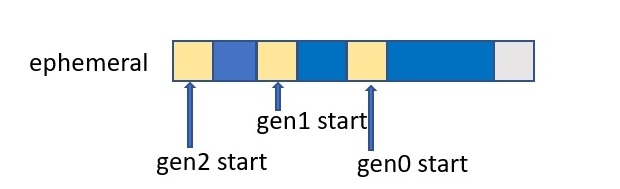
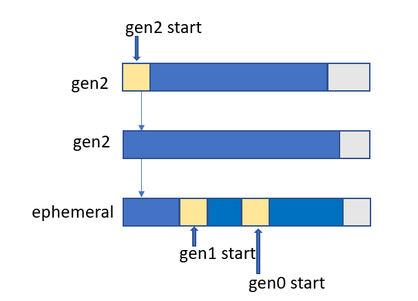
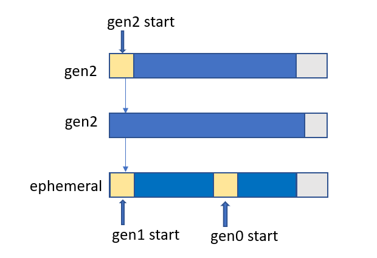
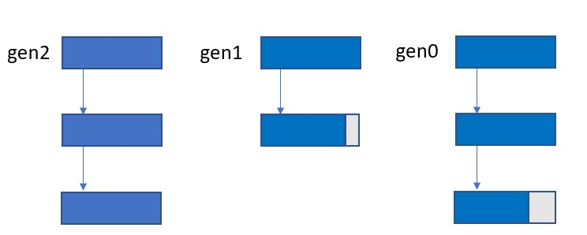
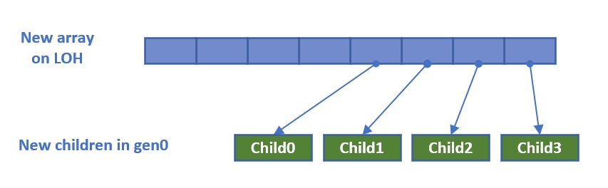
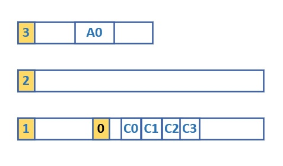
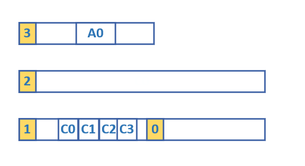
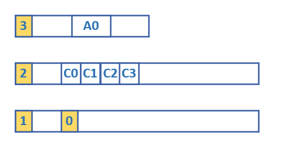
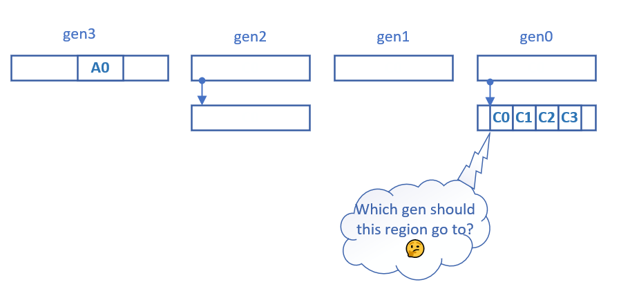
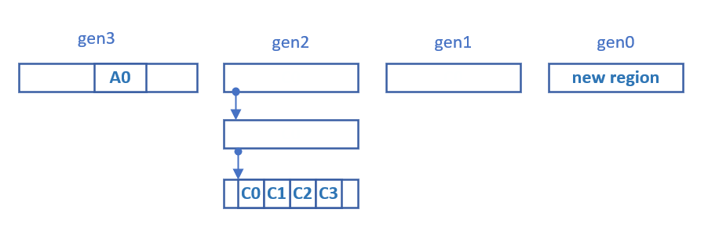

Say what? Yes, there's a new feature called DPAD for regions – regions is what we are currently working on in .NET 6 to convert segments to. In this blog post I will first give some introduction to regions then talk about the DPAD feature. Note that it's unlikely we will officially support regions by the end of 6.0 as there's a lot of work involved – our current plan is to ship it in clrgc.dll as an experimental feature that you can turn on with a config. In fact, this is the way I want to ship large GC features from now on – we ship them first with the standalone GC (ie, in clrgc.dll) so folks can try them out, then we officially turn them on in coreclr.dll so they are on by default.

As you know, so far we've been operating on segments. Segments served us well for years but I had started to notice the limitation it had as folks put more kinds of workloads on our framework. They are a foundation for our memory management so it's a big deal to switch away from them. When we were approaching .NET 6 I decided it was time that we evolved away from them so this is what our team has been spending a lot of time on lately. So what are the key differences between segments and regions? Segments are large units or memory – on Server GC 64-bit if the segment sizes are 1GB, 2GB or 4GB each (for Workstation it's much smaller – 256MB) on SOH. Regions are much smaller units, they are by default 4MB each. So you might ask, "so they are smaller, why is that significant?". To answer that, let's first review how segments work.

This is currently what SOH looks like on a heap when we have only one segment –

when we have multiple segments it could look like this

dpad

or this

dpad

The blue and yellow spaces are all committed memory (for an explanation of generation starts please see this video) on a segment. Each segment keeps track of what's committed on the segment so we know if we need to commit more. And all the free spaces on that segment are also committed memory. This works well when we use the free spaces to accommodate objects because we can use the memory right away – it's already committed. But imagine a scenario where we have free spaces in one generation, say gen0 because there's some async IO going on that caused us to demote a bunch of pins in gen0, that we don't actually use (this could be due to not waiting for so long to do the next GC or we'd have accumulated too much survival which means the GC pause would be too long). Wouldn't it be nice if we could use those free spaces for other generations if they need them! Same with free spaces in gen2 and LOH – you might have some free spaces in gen2, it would be nice to use them to allocate some large objects. We do decommit on a segment but only the end of the segment which is after the very last live object on that segment (denoted by the light gray space at the end of each segment). And if you have pinning that prevents the GC from retracting the end of the segment, then we can only form free spaces and free spaces are always committed memory. Of course you might ask, "why don't you just decommit the middle of a segment that has large free spaces?". But that requires bookkeeping to remember which parts in the middle of a segment are decommitted so we need to re-commit them when we want to use them to allocate objects. And now we are getting into the idea of regions anyway, which is to have much smaller amounts of memory being manipulated separately by the GC.

With regions the generations look uniformed and we no longer have this "ephemeral segment" concept. We have gen0 and gen1 regions, just like we have gen2 regions.

Of course the number of regions in each generation could be vastly different. But they all consist of these small memory units. LOH does have larger regions (it's 8x the size of SOH regions, so 32MB each). When we free a region, we return it to the free region pool and regions in that pool can be grabbed by any generation, or even by any other heap if needed. So you will no longer see this scenario where you have some huge free spaces in gen2 or LOH and they are not getting used for a long time (this can happen if your app behavior goes through phases where one phase could survive a lot more memory than another, and GC hasn't felt the need to do a full compacting GC).

We always have to make tradeoffs in GC work. And with regions we do gain a lot of flexibility. But we also have to give up some things. One thing that makes segments very attractive is we do have a contiguous ephemeral range since gen0 and gen1 always live on the ephemeral segment and always right next to each other. We take advantage of this when we set cards in the write barrier. If you do obj0.f = obj1, and we detect that obj1 is not in the ephemeral range, we don't need to set the card 'cause we don't need it (a card only needs to be set if obj1 is in a younger generation than obj0 and if obj1 is not in the ephemeral range it means it's either in gen2 or LOH/POH which are all considered logically as part of generation 2 (but internally are tracked as gen3 and gen4 and I’m using LOH and gen3 interchangeably in this post). And that means it's either in the same generation as obj0 or in an older generation than obj0). But we only do this optimization for Workstation GC as Server GC has multiple ephemeral ranges and we didn't want to have to compare against all of them in the write barrier code. In regions we'll either set cards unconditionally (which would regress Workstation GC pauses a bit but keep the same performance for Server GC) or check the region of obj1 in the write barrier which would be more expensive than checking for an ephemeral range in the most optimal type of write barriers. The benefits regions bring should more than justify this though.

Now we can talk about the DPAD feature. DPAD stands for Dynamic Promotion And Demotion. Strictly speaking, demotion is already dynamic as it only happens dynamically based on pinning situations. If you've read my mem-doc, demotion is explained there (and if you haven't, I strongly encourage you to). Basically demoting an object means it's not getting promoted like it normally would. For segments, demotion means we set a range of the ephemeral segment to be the "demoted range" and this range can only be from one point in the middle of the ephemeral segment to the end of that segment. In other words we don't ever set a range in the middle of the ephemeral segment to be the demoted range. This is exactly because with segments gen1 has to be right before gen0 on the ephemeral segment (on the same heap, that is). So we can't have a gen1 portion, followed by a gen0 portion and then followed by a gen1 portion again.

Promotion is a common concept in GC – it means if an object survives a generation, it's now considered part of the higher generation. So if you have a long lived small object on the SOH, it will eventually be promoted into gen2. But that means it will require 2 GCs for that to happen. I am planning to provide an API that gives users an option to tell the GC to allocate a new object directly into a certain generation so you could allocate objects you know will survive to gen2 directly in gen2 (I haven't implemented this API so far as it's also much easier with regions support so I'm planning to implement it when we have converted to regions). But that doesn't cover all cases since sometimes it's difficult for the users to know whether an object will "most likely survive to gen2". And you might be using a library and have no control over the allocation of those objects. One very distinct scenario where this would happen is with datastructure resizing. Let's say you or the library you are using allocated a list which needs to grow its capacity. So it allocates a new T[] object that can hold twice the amount of elements of the old one. Now it creates a bunch of child elements for the 2nd half. Now, if the new array is large enough to get on LOH and the new children are all small objects so they are in gen0 –

(I'm only showing an 8-element array and 4 new children for illustration purpose, if this was an object[] obviously it'd require more elements to get on the LOH)

In the segment case we'd see this –

Since the new array is considered part of gen2, it means all the new elements that got created in gen0 will survive to gen2 (unless a gen2 GC happens soon after and discovers the parent array dead already, which could happen but not very likely; and if it does happen that's pretty unfortunate 'cause you'd be paying all this cost to create a large object only to discard it right away). But for that to happen, it'd need to go through at least 2 GCs. It's very likely we'll first observe a gen0 or gen1 GC which survives these children to gen1.

And then the next gen1 GC will discover they are all still alive because they are held live by that array in LOH. Now it promotes them all to gen2.

For this scenario we'd prefer to just promote them directly into gen2. But this is difficult to do for segments. We could keep track of which plugs consist of these objects or mostly these objects but when we mark we don't know which objects would form plugs together. And when we are forming plugs we have lost that info. We could keep track of this info on a larger granularity. But guess what, that's basically like regions! Because we'd want to divide up a segment into smaller units to track that info. So for regions this is pretty easy. When we mark, we know exactly how much survives on each region – as we mark each object we track which region we need to attribute the survived bytes to. So we know how much of the survival is done by card marking.

With regions when we encounter a region that mostly consists of objects like these child objects that are held live due to card marking, we have a choice –

We can choose to promote this region directly to gen2 –

So that region is threaded into gen2. The other region that belonged to gen0 had survivors that were compacted into the gen1 region and gen0 gets a new region for allocations.

With the current implementation I'm doing this only for regions that mostly filled with objects like these. And since regions are small, it's very likely some regions are filled with these and then we have another region that's partly filled with these and partly some truly temporary objects. The complexity of separating them is unlikely worthy (you can think of it as we are back to the segments case for this particular region).

There are some complications (with GC there's almost always some complications…) when we do this. One example is since we now just made gen0 objects survive in gen2 we'll need to make sure if they point to any gen that's not gen2, the cards need to be set for those objects. We do this when we are going through survivors in the relocate phase (since we already have to go through each object anyway).

So pun (partially) intended, this DPAD feature is kind of like a D-pad… you can tell a region which direction it needs to go – up or down (in GC terms that would be older or younger). There are various scenarios where we'd want to dynamically promote or demote a region and the example I gave above is just one of them. The point is with regions we can dynamically assign a generation number we want a region to end up in because generations are no longer contiguous and there's no specific orders generations have to be relative to each other (of course as you can see above, there are implementation details that need to be taken care of for different scenarios). This is much more flexible than the limited amount of demotion we were doing with segments. And when we thread regions at the end of the GC, we just need to thread them into their assigned regions. With my initial checkin for DPAD, I've implemented 3 scenarios where we would dynamically promote or demote regions. In the future we'll implement more.

https://devblogs.microsoft.com/dotnet/put-a-dpad-on-that-gc/