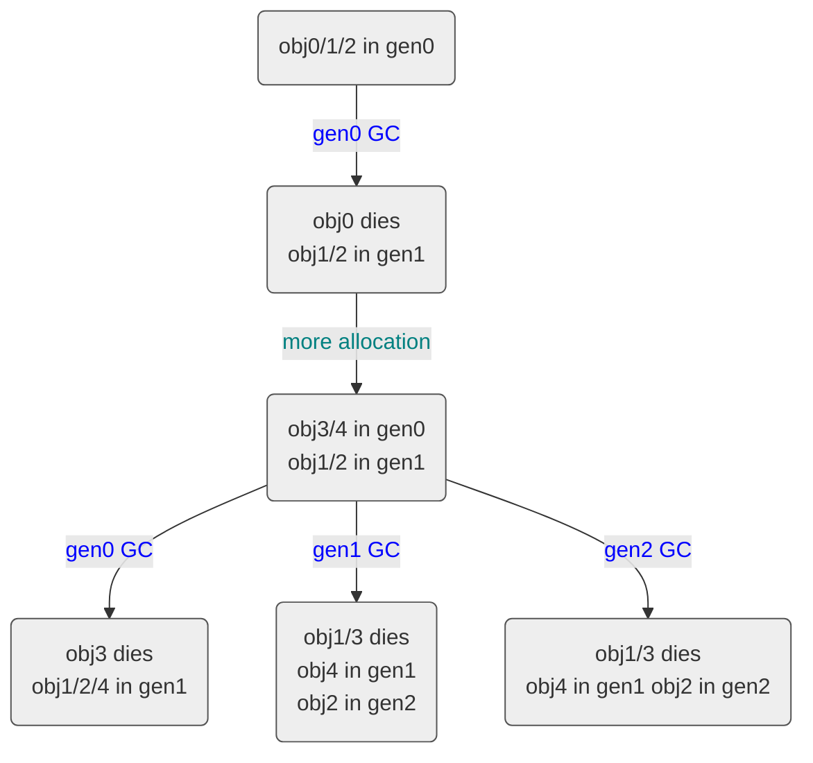

<h1>Women IC (Individual Contributor) engineer mentoring ring</h1>

During this fiscal year I ran a women IC mentoring ring in the Developer Division at Microsoft. It was part of the women's mentoring ring program in our division. I've always felt a little sad when I looked around and saw very few women ICs at very senior levels. Most women who advanced to those levels became managers. This was what prompted me to suggest such a mentoring ring to the organizers of the women's mentoring ring program. I'm happy to report that the ring remains one of the most requested so it will keep going for next fiscal year (I will however be leading a different mentoring ring just because we tend to change up the mentors in each ring from year to year).

As we are discussing next fiscal year's mentoring program, I came across the notes from the last one and wanted to share some of the discussions we had (that can be shared publicly) as I think these are generally applicable and could help other women (or men) too. These were a collective set of wisdom from everyone in my mentoring ring, many of them were suggested by mentees, not myself 🙂

# Time management

"There are so many PRs on my team, I want to review a lot of them so I can learn from them, but I don't have enough time!"

This was a pretty common question from especially more junior engineers and engineers who work on teams with a very diverse set of technology, eg, an API/SDK team. We talked about the following –

Spend your time wisely

You have to choose what you spend your time on. It's always good to be curious and to want to learn more but you have to decide what's relevant enough for you to spend time on. Know who the experts for areas relevant to you and ask them for their wisdom! On a healthy team, experienced folks are absolutely supposed to help new comers – it's part of their job.

<h2>Spend your time efficiently</h2>

If you believe there's something reasonable to mention in a PR but is not mentioned in the description, it's perfectly reasonable to ask to have that kind of info put in. For example, if a PR introduces a new pattern in the code base that's widely used in that PR, it's a reasonable thing to ask the author to describe that new pattern in the PR. Especially for APIs, asking for tests (or sometimes if you can, enforcing tests) to go with the implementation is a great to help you understand how to use the API. This can help you tremendously to understand the PR instead of having to figure out everything on your own.

"How to achieve better work life balance, especially for women who are mothers?"

Being clear about what other folks can expect from you is very helpful, eg, “I don’t work on weekends or at night”, “I don’t answer emails outside business hours unless it’s absolutely urgent, in which case text me”, or “the baby is here and may start crying and I’ll need to attend to him/her during the meeting”.
Give clear description of what work will be accomplished during a timeframe, eg, “it takes X hours/weeks to get to functional, no stress, no perf, no doc and this is with no distraction/interruption”.
Be strategic about your time management. For example, with kids you might need to scatter your work hours out around the kids’ activities.
When discussing work items with your manager, be clear about what to cut if you need to add something.
Adapt to changes, eg, if you WFH when your coworkers work from the office, be more responsive to their issues to not be the bottleneck, and request that they keep important conversations accessible to you (eg, in Teams channels instead of only chatting amongst themselves).
At the end of the day, it’s about your choices, do what is comfortable for you. More importantly, stick to your choices/priority list when you make them. For example, if you decide having kids is a priority, it means be ok with not putting in as much time for work when the kids are little. It doesn’t make much sense to compare how many hours you are putting in with your coworkers who don’t have kids and are willing to put in more hours, since spending time on your kids is also a fulfilling part of your life.
Communication skills
"How to voice my opinions in a conflicting situation instead of remaining quiet"

We've all been in conflicting situations before. Women tend to have more trouble voice opinions in such situations. This was actually brought up in the context of conflicting situations when reviewing PRs. The following was suggested –

Determine if it’s something worth spending time on and/or how much time you should spend it

Is it a trivial issue? Is it subjective? Does the other person have stronger opinions on it than you? If the answer to any of those is yes, that would be a factor that makes it less worthwhile for you to spend a lot of time on.
Recognize that it's perfectly valid to have emotions; also important to recognize whether these emotions have any long last effect. If it does that makes it a problem more worth solving.
If you need to interact with the person you are talking to long term (eg, your teammate) it also makes it more worthwhile to sort it out.
Recognize you don’t have to accept all comments on a PR.
When it does get emotional

Much easier to talk in person (or on Teams) if you have such options, than continue the discussion in email/GH. If we are talking about your teammates, you certainly have the options to talk to them face to face.
Take some time to cool down before chatting with the person.
Make the other person take some responsibility!

In case of fairly subjective matters, ask the other person to take responsibility to prove their way is more desirable. For example, if the person claims something should be the new pattern, ask them to make it a pattern and convince others on the team it should be this way, especially if they are more senior than you
"How to explain something clearly (eg, what you do; your idea; your suggestion) to others that may not be intimately familiar with it already?"

When applicable use code snippets to help explain.
Do a demo for folks
Use pictures! Get a tablet. I use this one which works very well with the whiteboard app and super easy to set up
Send out info before the meeting. Some people would read it and others may not. If the doc isn’t very long you could even dedicate the first few minutes of the meeting to make sure everyone has read it (briefly).
A good meme/video/analogy with an everyday item could make your explanation much easier to understand. I have an example of explaining the GC tuning with food courts here.
Share your explanation with one person to see how they think of it before sharing with more people
Ask the person if the thing you just explained made sense – this doesn’t work 100% of the time as some people would say it does when it doesn’t but there’re definitely people who will say “no” and asking this question gives them a perfect opportunity to ask questions.
"I'm junior on my team, how can I possibly change the culture of the team?"

One trick is to find a more senior person who's willing to mentor and advocate for you – when you ask nicely, usually folks will say yes. Asking someone for 15 mins of their time for a meeting will almost always yield a "yes". Be sure to be respectful of their time – one key thing I always make sure of is to have topics prepared before the mentoring session so I don't waste the other person's time.

"English is not my first language and I don't feel confident when speaking it. And when my teammates who share the same first language with me always talk to me in that language, what should/can I do?"

(This question obviously assumes English is the common language used at your work place, replace it with whatever language is at your work place)

If you are not talking about work it's totally okay to talk in whatever language you are comfortable with but if you are talking about work, really force yourself to get into a habit of speaking English. This is not just to practice your English; you are also appearing a little rude to your coworkers who don't understand that language (it's pretty easy to figure out whether you are talking about work – you hear English words here and there 🙂). Indeed it can be awkward to force yourself and your coworkers who want to talk to you about work in an language that's not English but it creates a much larger long-term benefit.

"Do I need to appear confident all the time?"

Not at all! It's totally fine to not be confident in topics you aren't knowledgeable about. Be okay with asking naive questions – if you are really worried, you could prefix your questions with "I'm not familiar with this so my questions are probably gonna be naive".

Productivity tools
Use SharpLab to see codegen for C# code

Use godbolt to see codegen for C++ code

Use ILSpy to see source for a .NET assembly

Use MermaidJS if you want to draw professional looking charts with simple lines of text. An example is here which was done with some simple mermaidjs script with a mermaidjs extension in VS code:

Copy
graph TD
Copy
        A(obj0/1/2 in gen0) -->|gen0 GC| B(obj0 dies obj1/2 in gen1)
        B -->|more allocation| C(obj3/4 in gen0 obj1/2 in gen1)
        C -->|gen0 GC| D(obj3 dies obj1/2/4 in gen1)
        C -->|gen1 GC| E(obj1/3 dies obj4 in gen1 obj2 in gen2)
        C -->|gen2 GC| F(obj1/3 dies obj4 in gen1 obj2 in gen2)
    classDef nodeStyle fill:#eee,stroke:#555;
    class A,B,C,D,E,F nodeStyle;
    linkStyle 0,2,3,4 color:blue;
    linkStyle 1 color:teal;
Use the Docs Authoring Pack extension in VS code to help with doc work

Use the Code spell checker extension in VS code to check for spelling

Use the OpenAPI editor extension in VS code to make looking at swagger files (REST API description) easy

 

https://devblogs.microsoft.com/dotnet/women-ic-engineer-mentoring-ring/

在今年的财政年度中，我在微软的开发者部门组织了一个针对女性工程师（Individual Contributors, ICs）的导师指导小组。这是该部门女性导师计划的一部分。我一直对周围看到的现象感到有些遗憾：在非常高级别的岗位上，女性工程师的数量很少。大多数晋升到这些级别的女性成为了管理者。这促使我向女性导师计划的组织者建议成立这样一个指导小组。我很高兴地报告，这个指导小组仍然是最受欢迎的项目之一，因此将在下一财年继续进行（不过我会带领一个不同的指导小组，因为我们通常每年都会更换不同组的导师）。

在我们讨论下一财年的导师计划时，我偶然发现了去年的笔记，并想分享一些可以公开的内容，因为我认为这些内容具有普遍适用性，可以帮助其他女性（或男性）。这些都是来自我的指导小组中的集体智慧，其中许多建议是由被指导者提出的，而不是我自己。

---

### 时间管理

**“我的团队有太多代码审查（PRs），我想多参与以从中学习，但没有足够的时间！”**

这是一个特别常见于初级工程师和工作在技术多样性较高的团队中的问题，例如 API/SDK 团队。我们讨论了以下几点：

#### 智慧地分配时间
你需要选择把时间花在哪里。保持好奇心并渴望学习更多是很好的，但你必须决定哪些事情对你来说足够相关值得投入时间。了解相关领域的专家并向他们请教！在一个健康的团队中，经验丰富的成员绝对应该帮助新人——这是他们工作的一部分。

#### 高效地利用时间
如果你认为某个 PR 中有一些合理的内容需要提及但未在描述中提到，完全可以要求作者补充相关信息。例如，如果一个 PR 引入了一种广泛使用的新模式，要求作者在 PR 中描述这种新模式是合理的。特别是对于 API，要求提供测试（或者在可能的情况下强制执行测试）与实现一起提交，这对理解如何使用 API 非常有帮助。这能大大减少你自己摸索的时间。

**“如何实现更好的工作与生活平衡，尤其是对于身为母亲的女性？”**
明确他人对你的期望是非常有帮助的，例如，“我不在周末或晚上工作”，“除非绝对紧急，否则不在工作时间外回复邮件，紧急情况下请短信联系我”，或者“孩子在这里，可能会哭闹，我需要在会议期间照顾他/她”。
清楚地描述在特定时间段内将完成的工作，例如，“达到功能性需要 X 小时/周，无压力、无性能优化、无文档编写，并且假设没有干扰/中断”。
战略性地管理你的时间。例如，如果有孩子，你可能需要围绕孩子的活动分散工作时间。
与经理讨论工作任务时，明确如果需要添加新任务，哪些可以削减。
适应变化，例如，如果你在家办公而同事在办公室，尽量更快速响应他们的需求以免成为瓶颈，并要求他们将重要对话记录在可访问的地方（例如 Teams 通道，而不是私下聊天）。
最终，这取决于你的选择，做让你感到舒适的事情。更重要的是，在做出选择后坚持你的优先级列表。例如，如果你决定抚养孩子是一个优先事项，那么当孩子还小时减少工作时间是可以接受的。与没有孩子的同事比较工作时间并不明智，因为陪伴孩子也是生活中令人满足的一部分。

---

### 沟通技巧

**“如何在冲突情况下表达自己的意见而不是保持沉默？”**

我们都经历过冲突情况。女性在这种情况下往往更难表达自己的意见。这个问题是在代码审查（PRs）冲突情境下提出来的。以下是建议：

#### 判断是否值得花时间以及花多少时间
这是一个琐碎的问题吗？是主观的吗？对方的意见比你更强吗？如果这些问题的答案中有任何一个为“是”，那这就降低了你花大量时间在这个问题上的价值。
认识到情绪的存在是完全合理的；同时也要判断这些情绪是否有长期影响。如果是，则说明这个问题更值得解决。
如果你需要长期与对方互动（例如，你的队友），那么解决问题就更有价值。
认识到你不必接受 PR 中的所有评论。

#### 当情绪化时
如果条件允许，面对面交流（或通过 Teams）比继续通过电子邮件/GH 讨论更容易。如果是你的队友，你当然可以选择面对面交谈。
在与对方聊天前给自己一些冷静的时间。
让对方承担部分责任！

对于较为主观的问题，要求对方负责证明他们的方法更好。例如，如果某人声称某事应该是新模式，要求他们将其作为模式并说服团队其他人采用这种方式，特别是如果他们比你资深。

**“如何清晰地向不熟悉相关内容的人解释某事（例如，你的工作、想法或建议）？”**

在适用的情况下，使用代码片段来帮助解释。
做一个演示给人们看。
使用图片！买个平板电脑。我用的这款与白板应用程序配合得很好，设置也非常简单。
提前发送信息。有些人会阅读，有些人可能不会。如果文档不长，甚至可以在会议的前几分钟专门确保每个人都简要阅读过。
一个好的表情包/视频/类比（用日常物品）可以让解释更容易理解。例如，我有一个用美食广场解释垃圾回收调优的例子。
在与更多人分享之前，先与一个人分享你的解释，看看他们的反应。
问对方你刚刚解释的内容是否有意义——虽然这不能100%有效，因为有些人即使没听懂也会说“明白”。但肯定有人会说“不”，并且提出问题的机会也很好。

**“我是团队中的新人，我怎么可能改变团队的文化？”**

一个技巧是找到一位愿意指导和支持你的资深人士——当你礼貌地请求时，通常他们会答应。请求15分钟的会议时间几乎总是能得到“同意”。务必尊重对方的时间——我总是确保在辅导会议前准备好话题，以免浪费别人的时间。

**“英语不是我的母语，我用英语说话时没有信心。当我的同事与我共用同一母语并在工作中用母语与我交谈时，我该怎么办？”**

（这个问题显然假设英语是你工作场所的通用语言，替换为你工作场所的语言即可。）

如果不是谈论工作，用任何让你感到舒适的语言交流都是完全可以的。但如果是在谈论工作，真的要强迫自己养成用英语交流的习惯。这不仅是为了练习英语，你还显得对不懂该语言的同事稍微有些失礼（很容易判断你们是否在谈工作——你会听到一些英语单词）。确实，强迫自己和希望用非英语与你交谈的同事沟通可能会有些尴尬，但从长远来看，这样做会有更大的好处。

**“我是否需要一直表现得自信？”**

当然不需要！在你不熟悉的领域表现出不自信是完全可以接受的。不要害怕问一些看似简单的问题——如果你真的很担心，可以在问题前加上“我对这个不太熟悉，所以我的问题可能很基础”。

---

### 生产力工具

- 使用 [SharpLab](https://sharplab.io/) 查看 C# 代码生成。
- 使用 [godbolt](https://godbolt.org/) 查看 C++ 代码生成。
- 使用 [ILSpy](https://github.com/icsharpcode/ILSpy) 查看 .NET 程序集的源码。
- 如果你想用简单的文本绘制专业图表，可以使用 [MermaidJS](https://mermaid-js.github.io/)。例如，以下是一个用 MermaidJS 脚本绘制的图示例（在 VS Code 中使用 MermaidJS 扩展）：

- 在 VS Code 中使用 Docs Authoring Pack 扩展来帮助编写文档。
- 在 VS Code 中使用 Code Spell Checker 扩展检查拼写错误。
- 在 VS Code 中使用 OpenAPI Editor 扩展简化查看 Swagger 文件（REST API 描述）的过程。